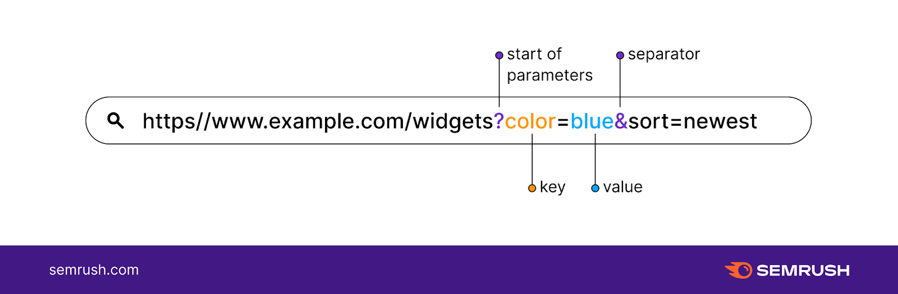

## Introducción

Los parámetros de consulta, también conocidos como Query Params, son una parte integral de las URL que usamos en nuestra vida diaria. Son parámetros que se adjuntan al final de una URL y se separan de la URL por un signo de interrogación (?)¹.

## ¿Qué son los Parámetros de Consulta?

Los parámetros de consulta son parámetros que se adjuntan al final de una URL y se separan de la URL por un signo de interrogación (?). La sección antes del signo de interrogación es el parámetro de ruta, y la sección después del signo de interrogación es la consulta. El parámetro de ruta define la ubicación del recurso, mientras que el parámetro de consulta define operaciones de clasificación, paginación o filtrado¹.

## Ejemplo de Parámetro de Consulta

Por ejemplo, en `https://www.google.com/search?q=abstract%20api`, tenemos una búsqueda estándar de Google, con la entrada del usuario `abstract%20api` que se pasa como una variable a través del parámetro de consulta `q=`¹. Podemos pasar múltiples variables con el símbolo `&` separando los parámetros, formando una cadena de consulta¹.

## ¿Qué puedo hacer con los Parámetros de Consulta?

Los parámetros de consulta se pueden utilizar en nuestras solicitudes de API REST a los puntos finales¹. Por ejemplo, si queremos llamar a una API de clima para nuestro informe de surf diario¹:

```
curl GET /surfreport/beachId?days=3&units=metric&time=1400
```

En esta solicitud GET, `/surfreport/beachID` es el punto final, y `beachID` es el parámetro de ruta. Los parámetros de ruta son parte del punto final y son requeridos¹. `?` es donde comienza nuestra cadena de consulta. `days=3` es un parámetro de consulta (`days`) que está tomando el argumento `3` para ordenar el informe de surf obtenido de la API en resultados de los próximos tres días¹. `units=metric` es un parámetro de consulta que muestra nuestros resultados en unidades métricas¹. `time=1400` es un parámetro de consulta que muestra los resultados a las 14:00¹. `&` está uniendo nuestros parámetros de consulta individuales en una cadena de consulta¹.

## Conclusión

Los parámetros de consulta son una herramienta poderosa que nos permite interactuar con las API y los recursos web de manera más efectiva. Nos permiten filtrar, ordenar y paginar los recursos de una manera que sería difícil o imposible sin ellos. A medida que continuamos construyendo y utilizando aplicaciones web, es esencial entender y utilizar eficazmente los parámetros de consulta.

## Recursos

## Ejemplo en imagen



## Más lectura

https://www.abstractapi.com/api-glossary/query-parameters
