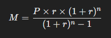

Este proyecto consiste en crear una calculadora de reembolso de hipoteca que permita a los usuarios calcular el pago mensual de su hipoteca utilizando **HTML**, **CSS**, **JavaScript**, y **Bootstrap**.

## Objetivos

- Diseñar una interfaz intuitiva que incluya campos de entrada para el monto del préstamo, la tasa de interés, y el plazo de la hipoteca.
- Implementar la lógica de cálculo del pago mensual de la hipoteca utilizando JavaScript.
- Mostrar el resultado del cálculo de forma clara y fácil de entender para el usuario.
- Asegurar que la calculadora sea completamente responsiva utilizando **Bootstrap** para garantizar una buena experiencia en diferentes dispositivos.

## Requisitos

1. **HTML**: Estructura la calculadora con campos de entrada para los datos necesarios (monto del préstamo, tasa de interés anual y plazo en años) y un botón para calcular.
2. **CSS**: Aplica estilos adicionales con CSS para mejorar la presentación visual que no se pueda conseguir solo con Bootstrap.
3. **JavaScript**: Implementa la lógica que realice los cálculos del pago mensual basados en la entrada del usuario.
4. **Bootstrap**: Utiliza clases de Bootstrap para diseñar una interfaz moderna y responsiva.

## Fórmula de Cálculo

Para calcular el pago mensual de la hipoteca, utiliza la siguiente fórmula:

Donde:

- **M** = Pago mensual.
- **P** = Monto del préstamo.
- **r** = Tasa de interés mensual (tasa de interés anual dividida por 12).
- **n** = Número total de pagos (número de años multiplicado por 12).

## Instrucciones

1. Ingresa al siguiente link y haz clic en "START CHALLENGE" para descargar el archivo `.zip` que te permitirá iniciar con el proyecto.

   - [Link](https://www.frontendmentor.io/challenges/mortgage-repayment-calculator-Galx1LXK73)

2. Crea un nuevo archivo HTML (`index.html`) para la calculadora de hipoteca.
3. Incluye la biblioteca de Bootstrap en tu proyecto (puedes usar un CDN).
4. Diseña la interfaz de usuario con los campos de entrada necesarios, un botón de cálculo, y un área para mostrar el resultado.
5. Añade la lógica de JavaScript para calcular el pago mensual de la hipoteca utilizando la fórmula proporcionada.
6. Asegúrate de que el diseño sea responsivo en todos los dispositivos.
7. Sube tu solución a GitHub.

## Entregables

- Link a tu repositorio de GitHub con el código de tu aplicación.
- Link a tu página desplegada.

---

Este texto proporciona una explicación clara de cómo calcular el pago mensual de la hipoteca utilizando la fórmula adecuada, junto con todos los detalles necesarios para completar el proyecto.
