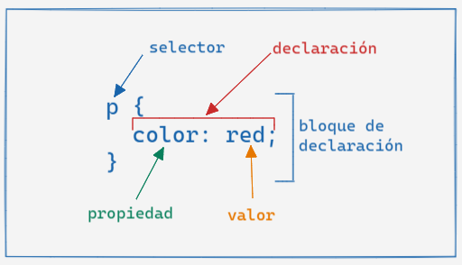
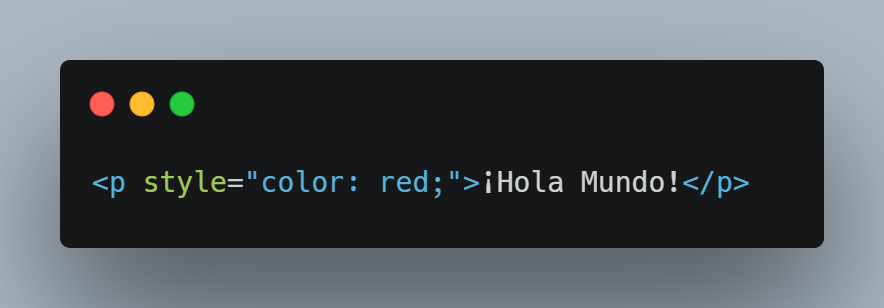
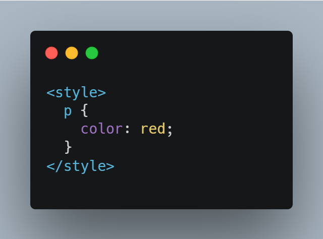
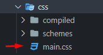

## Que es CSS?

Como HTML, CSS (Cascading Style Sheets) u Hojas de estilo en cascada en español, no es realmente un lenguaje de programación, tampoco es un lenguaje de marcado. Es un lenguaje de hojas de estilo, es decir, te permite aplicar estilos de manera selectiva a elementos en documentos HTML. Por ejemplo, para seleccionar todos los elementos de párrafo en una página HTML y volver el texto dentro de ellos de color rojo, has de escribir este CSS:

```css
p {
    color: red;
    /* Selecciona la etiqueta p y cambia el color a rojo */
}
```

CSS nos ayuda a generar un gran cambio en nuestras páginas web y su sintáxis es distintia a HTML.

## Sintáxis 



El `selector` nos ayuda a identificar a que elemento(s) se le aplicarán los estilos.
El `bloque de declaración` es donde se escriben los estilos, tener en cuenta que se inicia y culmina con llaves `{}`.
La `declaración` es donde ajustamos una cosa de el/los elemento(s), se compone por la `propiedad` que representa lo que vamos a ajustar y el `valor` que representa como lo vamos a cambiar (Cambiaremos los elementos p, le cambiaremos el color a rojo).

## Donde escribir CSS

Hay 3 lugares o formas de escribir CSS: inline, internal y external (en línea, interno y externo).

### Inline



dentro de las etiquetas de apertura HTML podemos añadir el atributo style y como parte de su valor, podemos indicar las declaraciones CSS separadas por `;`

### Internal



dentro de la `<head>` podemos insertar la etiqueta `<style> `donde podremos ingresar nuestro codigo css. Esto trae la ventaja de usar los selectores a diferencia de los estilos inline, que se aplican a cada elemento.

### External



External hace referencia a escribir CSS en un archivo  aparte donde solo irá este código. la forma de escribir aquí sigue siendo en bloque sin la necesidad de una etiqueta `<style>`, aunque necesitamos enlazar el archivo HTML con este, por medio de una etiqueta link dentro del head similar a esta:

```html
<link rel="stylesheet" href="./css/main.css">
```

## Tutorial de CSS

Durante el temario que estudiaste antes de ingresar a Funval, te dejamos un video del canal <mark>Hola Mundo</mark>. Hoy y mañana vamos a repasar los conceptos que vimos en ese video. Te recomendamos ver hasta media hora antes de la clase y el resto del tiempo comiences a trabajar con los tutoriales de freeCodeCamp de CSS.



## Aprendiendo con Práctica

Continua reforzando tu conocimiento de HTML y CSS siguiendo estos cursos:

[HTML - Aplicacion de fotos de gatos](https://www.freecodecamp.org/espanol/learn/2022/responsive-web-design/#learn-html-by-building-a-cat-photo-app)

[CSS - Menú de Cafetería](https://www.freecodecamp.org/espanol/learn/2022/responsive-web-design/#learn-basic-css-by-building-a-cafe-menu)
