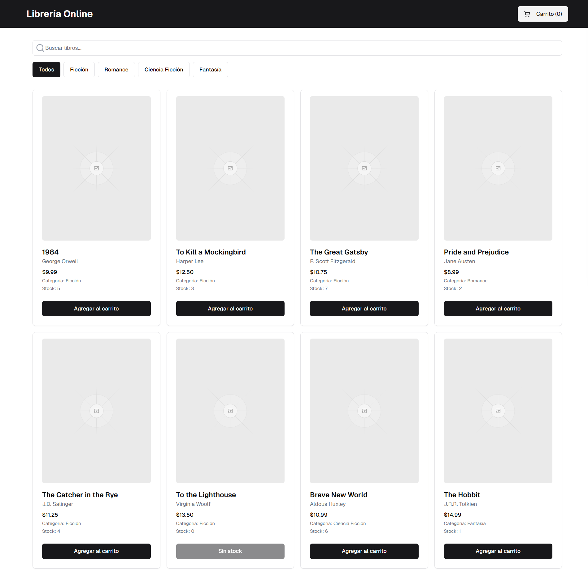
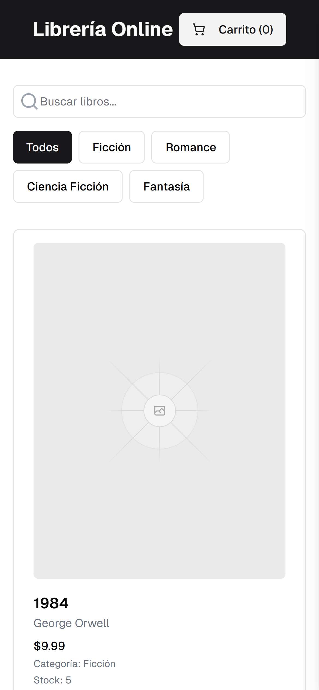
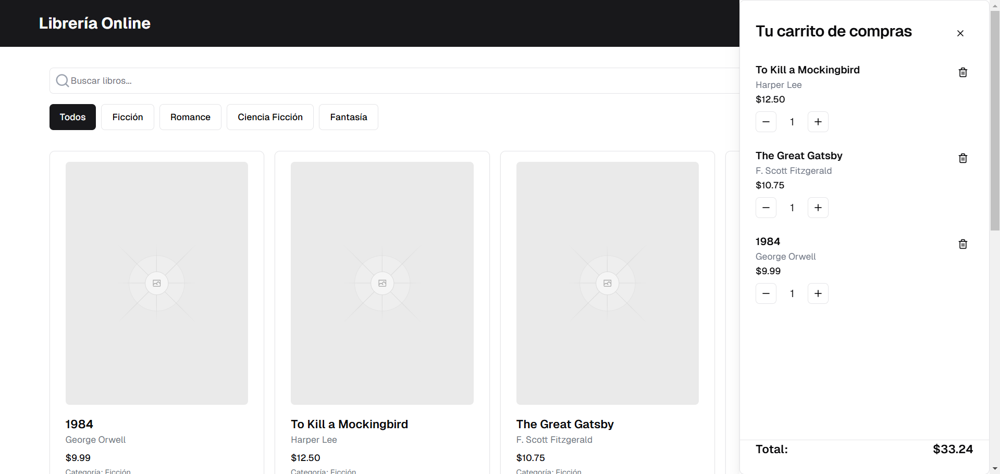
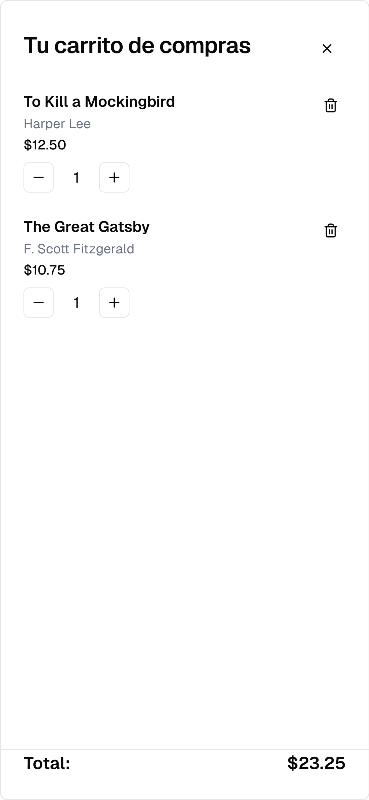

Librería Online es una aplicación web de comercio electrónico para la venta de libros. Los usuarios pueden explorar el catálogo, filtrar por categorías, agregar productos al carrito y gestionar sus compras de manera intuitiva.

## 🚀 Características

- Catálogo de libros con información como título, autor, precio, categoría y stock.
- Búsqueda y filtrado por categorías para una navegación más eficiente.
- Gestión de carrito de compras, permitiendo agregar, quitar y actualizar la cantidad de productos.
- Diseño responsivo, adaptable a dispositivos móviles y de escritorio.

## 🖥️ Interfaz

### Vista de Escritorio:

- Se presenta el catálogo en un diseño en cuadrícula.
- Botón de "Agregar al carrito" en cada libro.
- Carrito accesible en la esquina superior derecha con detalles de la compra.

### Vista Móvil:

- Diseño en lista para una mejor visualización en pantallas pequeñas.
- Funcionalidad de filtrado y búsqueda optimizada.
- Carrito accesible con un diseño tipo modal.

    

### Carrito de Compras:

- Lista de productos añadidos con opciones para aumentar o disminuir cantidad.
- Eliminación de productos con un solo clic.
- Cálculo automático del total de la compra.

 

    

