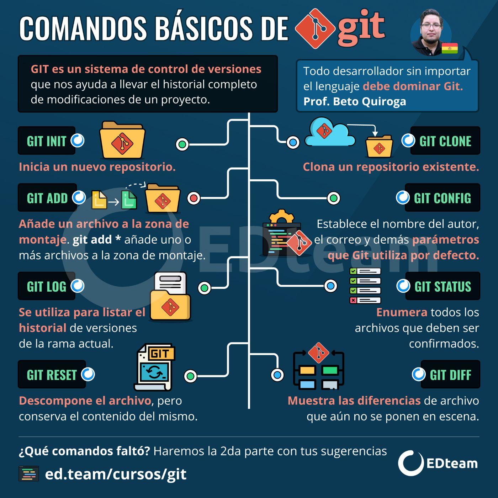
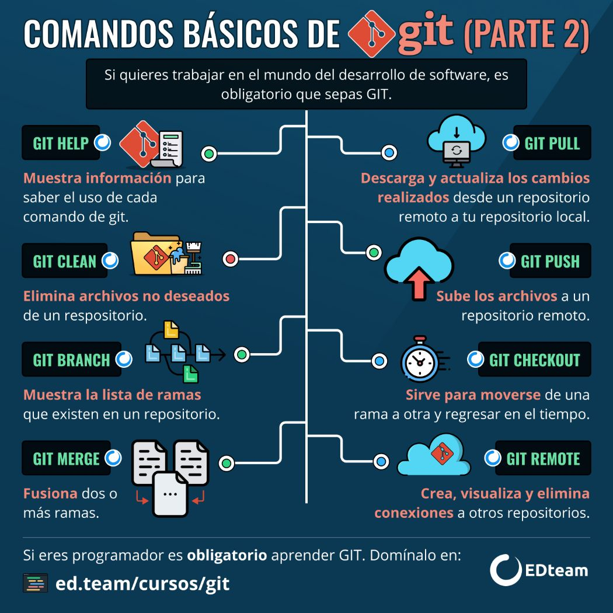

## Conceptos básicos de Git
Git es un sistema de control de versiones distribuido que te permite rastrear los cambios en tus proyectos y colaborar con otros desarrolladores de manera eficiente. Aquí tienes algunos conceptos esenciales:

## Repositorio
Un repositorio es un lugar donde se almacenan todos los archivos y la historia de cambios de tu proyecto. Puede ser local (en tu máquina) o remoto (en un servidor, como GitHub o GitLab).

## Commit
Un commit representa un punto en el tiempo en la historia de tu proyecto. Es una instantánea de los cambios realizados en los archivos desde el último commit. Cada commit tiene un mensaje que describe los cambios realizados.

## Branch (Rama)
Una rama es una versión paralela del repositorio que permite trabajar en nuevas funcionalidades o correcciones sin afectar la rama principal (generalmente llamada main o master). Es útil para el desarrollo colaborativo y la gestión de cambios.

## Merge (Fusión)
La fusión es el proceso de combinar los cambios de una rama en otra. Se utiliza para integrar el trabajo realizado en una rama secundaria de vuelta a la rama principal.

## Clone (Clonar)
Clonar un repositorio significa copiarlo desde un repositorio remoto a tu máquina local. Esto te permite trabajar en tu propia copia del proyecto.

## Pull (Tirar) y Push (Empujar)
Pull: Descargar los cambios realizados en un repositorio remoto y fusionarlos con tu versión local.
Push: Subir tus cambios locales a un repositorio remoto para compartirlos con otros colaboradores.
## Status (Estado)
El comando git status te muestra el estado actual de tu repositorio, incluyendo los archivos modificados, los archivos que se han añadido al área de preparación (staging area) y los que están listos para hacer commit.

## Add (Agregar)
El comando git add añade los cambios de los archivos al área de preparación, lo que los prepara para ser incluidos en el próximo commit.

## Commit (Confirmar)
El comando git commit guarda los cambios en el repositorio como un nuevo commit con un mensaje que describe los cambios realizados.

## Push (Empujar)
El comando git push envía los commits locales al repositorio remoto, actualizando la versión remota con tus cambios.

## Pull (Tirar)
El comando git pull descarga los cambios desde el repositorio remoto y los fusiona automáticamente con tu versión local.

Estos son solo los conceptos básicos para empezar a utilizar Git. Hay muchos más comandos y funcionalidades que puedes aprender a medida que profundices en el control de versiones y el trabajo colaborativo.

## Comandos adicionales
Existen mas formas de usar git.

Recuerda que practicar y experimentar con Git te ayudará a familiarizarte con su uso y te permitirá aprovechar al máximo todas sus capacidades. ¡Buena suerte!

## Homework
Terminar la seccion 1, los ejercicios 1 y 2

https://learngitbranching.js.org/

Terminar hasta la seccion git branch

https://www.w3schools.com/git/git_exercises.asp