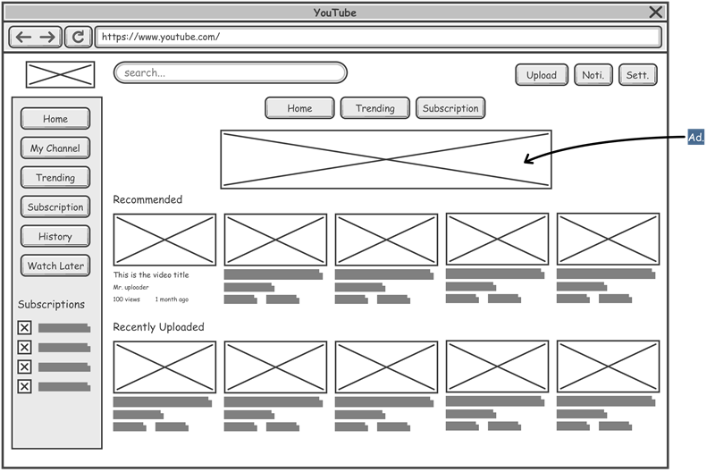
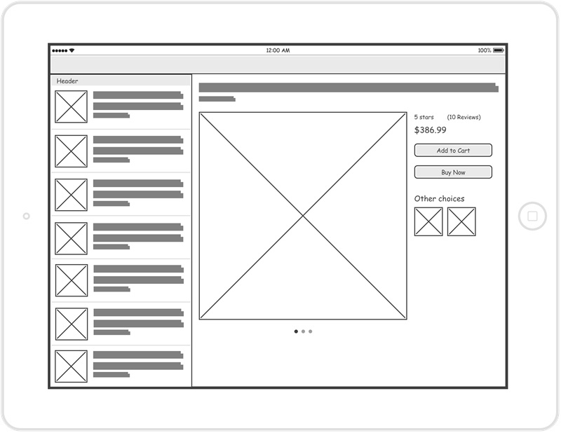
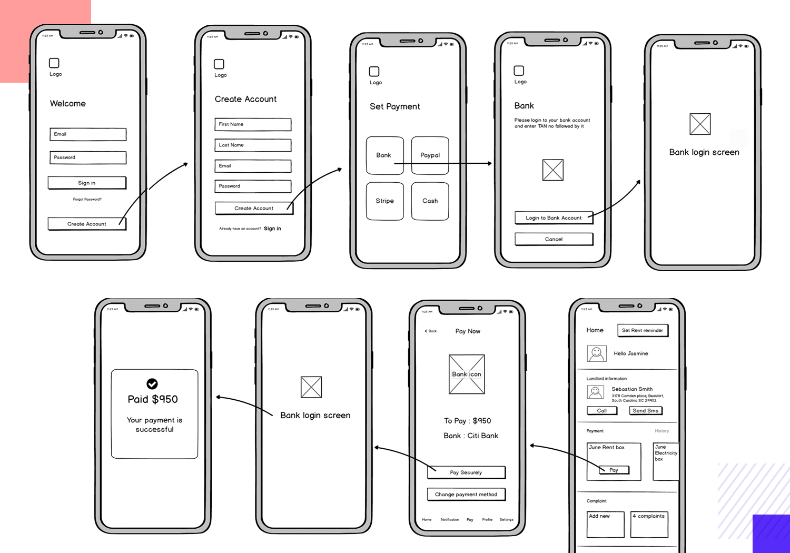
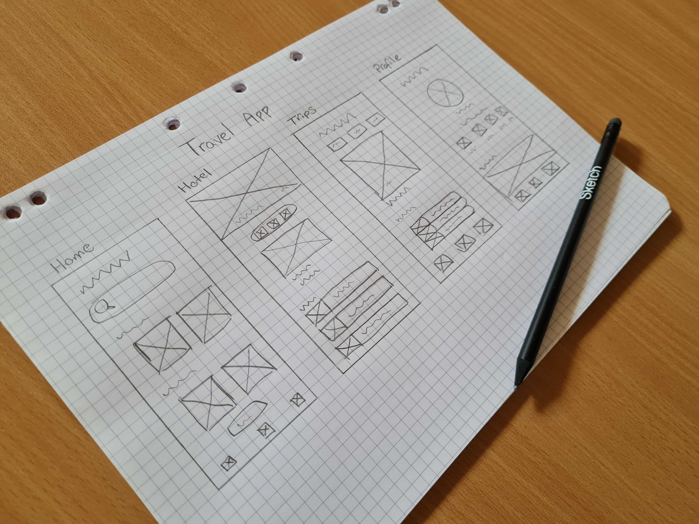
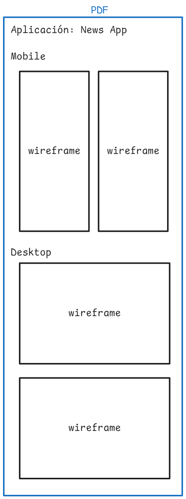

Un **wireframe** es una representación visual simplificada de una página web o aplicación. Funciona como un boceto que define la estructura y los elementos fundamentales del diseño, como botones, menús, texto, imágenes y enlaces, sin enfocarse en los detalles estéticos o gráficos. Los wireframes permiten a los diseñadores y desarrolladores visualizar el contenido y la funcionalidad de la interfaz antes de comenzar a escribir código.

## ¿Por qué usar un wireframe antes de escribir código?

El uso de wireframes en la fase de planificación es crucial porque permite:

1. **Claridad de ideas**: Ayuda a comunicar claramente la disposición y la estructura de la página tanto al equipo de diseño como al cliente.
2. **Ahorrar tiempo y recursos**: Detecta problemas de diseño y usabilidad antes de que se escriba una sola línea de código, lo que evita cambios costosos en etapas avanzadas del desarrollo.
3. **Facilitar la iteración**: Permite realizar cambios rápidos y obtener retroalimentación temprana, agilizando el proceso de desarrollo.

## Mejores prácticas para crear un wireframe

Para elaborar un wireframe efectivo, es recomendable seguir estas mejores prácticas:

1. **Simplicidad**: No es necesario incluir colores, imágenes detalladas ni tipografía específica. Enfócate en la estructura y la colocación de los elementos.
2. **Enfoque en la funcionalidad**: Piensa en la experiencia del usuario (UX) y en cómo interactuarán con los elementos de la página.
3. **Uso de anotaciones**: Agrega notas para explicar la funcionalidad de ciertos componentes o para indicar comportamientos específicos.
4. **Considera diferentes dispositivos**: Crea wireframes tanto para mobile como para desktop, teniendo en cuenta el diseño responsive.
5. **Obtener retroalimentación**: Comparte el wireframe con otros para recibir comentarios y ajustar antes de avanzar al diseño detallado.

Aquí tienes la lista actualizada con **Moqups** incluido:

## Herramientas online para crear wireframes

1. **[Figma](https://www.figma.com/)**
2. **[Wireframe.cc](https://wireframe.cc/)**
3. **[Mockflow](https://www.mockflow.com/)**
4. **[Moqups](https://moqups.com/)**

Estas herramientas son una excelente opción para diseñar y planificar la estructura de tu proyecto, pero recuerda que también puedes optar por hacerlo a mano con papel y lápiz en etapas iniciales.

## Ejemplos de wireframes

Aquí tienes algunos ejemplos de wireframes que puedes utilizar como referencia:

## Tarea

**Crea el wireframe** para el proyecto de clase que has elegido. Debes incluir las versiones mobile y desktop de tu diseño. Puedes usar herramientas online o hacerlo a mano con papel y lápiz. Una vez finalizado, sube tu wireframe en un archivo PDF con ambas versiones (mobile y desktop).

Este es un ejemplo del contenido que debe tener tu archivo PDF:

