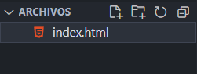
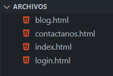
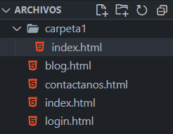
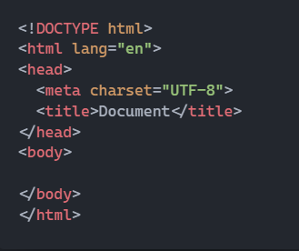

## Organizar HTML

Durante el proceso de inducción aprendiste las bases de HTML, hoy vamos a repasar algunas cosas de este lenguaje.

### Anatomía HTML

Anatomía HTML

Los elementos HTML que siempre encontrarás luego de `<!DOCTYPE html>` son:

- `<html></html>`: El elemento `<html>` envuelve todo el contenido de la página. A veces se le conoce como el elemento raíz.
- `<head></head>`: Es la cabecera de la página y no la verá el cliente. Aquí pondrás información e instrucciones de tu página que sólo deberá interpretar el navegador.
- `<meta charset="utf-8">`: las etiquetas meta sirven para dar diferentes instrucciones al navegador, esta configuración en concreto le dice al navegador que tu página usará la configuración de caracteres UTF-8 que incluye la mayoría de caracteres de todos los lenguajes humanos escritos. Esta etiqueta va dentro de la etiqueta `<head>`.
- `<title></title>`: Aquí se establece el título de la página, este aparecerá en la pestaña del navegador. También se utiliza para describir la página. Esta etiqueta va dentro de la etiqueta `<head>`.
- `<body></body>`: El elemento `<body>` contiene todo el contenido que quieres mostrar a los usuarios cuando visitan tu página, ya sea texto, imágenes, vídeos, juegos, pistas de audio reproducibles o cualquier otra cosa.

### index.html

Cuando trabajamos con archivos HTML debemos comenzar teniendo en cuenta el nombre de nuestro archivo. como convención, cuando se crea un sitio web, el archivo principal se llama **index.html** . Esto es porque los navegadores por defecto, al ingresar en una dirección web, buscan el archivo HTML que tenga este nombre, y será la primera página que se visita.

Los demás archivos HTML pueden tener otro nombre según sea necesario.

Asimismo, si tenemos archivos HTML dentro de una carpeta, debemos ponerle de nombre index.html al archivo HTML principal de esa carpeta.

### Indentación

Cuando tenemos nuestros archivos HTML, habrás notado que algunos elementos están más a la derecha que otros:

En este ejemplo, los elementos `<meta>` y `<title>` se encuentran indentados. Es decir, están separados del margen izquierdo por una tabulación haciendo la lectura más sencilla. Con esto entendemos que los elementos `<meta>` y `<title>` son elementos "hijo" del elemento `<head>`.

Esta estructura ayuda a la legibilidad del código y es de uso común en los lenguajes de programación. Te recomendamos seguir esta buena práctica a fin de que tu código sea legible y evitar que se convierta en un caos.

## CSS3: Box Model

Ya que entendemos las cosas básicas de HTML y CSS debemos tener presente lo sigiuente: **Cada elemento en el diseño web es una caja rectangular**. Este punto es importante para comprender como trabajamos con CSS y lograr el diseño que queremos lgrar. Si bien es cierto podemos posicionar los elementos y darles estilos con CSS, es importante que entendamos como funciona esa caja en sí.

El Box model (modelo de caja) explica el tamaño de los elementos en función de algunas propiedades de CSS.

Desde el interior hacia el exterior, tenemos:

- Content (contenido)
- padding (relleno)
- border (borde o frontera)
- margin (margen)

La mejor manera de visualizar el modelo de caja es abrir el navegador DevTools y comprobar cómo se muestra:

Aquí puedes ver cómo Firefox me dice las propiedades de un elemento `span` que destaqué. Hice clic con el botón derecho en él, presioné Inspeccionar elemento y fui al panel Diseño de DevTools.

Mira, el espacio azul claro es el área de `content`. Rodeándolo está el `padding`, luego el `border` y finalmente el `margin`. De forma predeterminada, si estableces un ancho (o alto) en el elemento, se aplicará al área de `content` . Todos los cálculos de padding, border y margin se realizan fuera del valor, por lo que debes tener esto en cuenta cuando realices el cálculo. Se puede cambiar este comportamiento utilizando Box-sizing (puedes buscar más información de esta propiedad [aqui](https://developer.mozilla.org/es/docs/Web/CSS/box-sizing)).

Entender este punto, te puede ayudar a realizar diseño con CSS de manera más sencilla, por lo que mira el siguiente video y toma nota entre las diferencias entre cada una de las partes del box model:



### Display

Ahora que entiendes un poco mejor lo que es el box model, es importante que sepas que las cajas en CSS pueden comportarse de manera distinta de acuerdo a una propiedad conocida como `display`. Esta propiedad nos indica la forma en la que el elemento será representado en el navegador y usar alguno de estos display, alterará considerablemente el comportamiento del navegador con el elemento y sus hijos.

En esta sección analizaremos los más importantes no cubiertos en otra parte:

- block
- inline
- inline-block
- none

en el siguiente video aprenderás la diferencia entre cada uno de estos y como afectan al modelo de caja:



