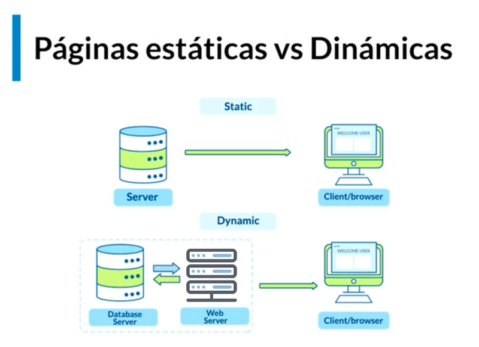
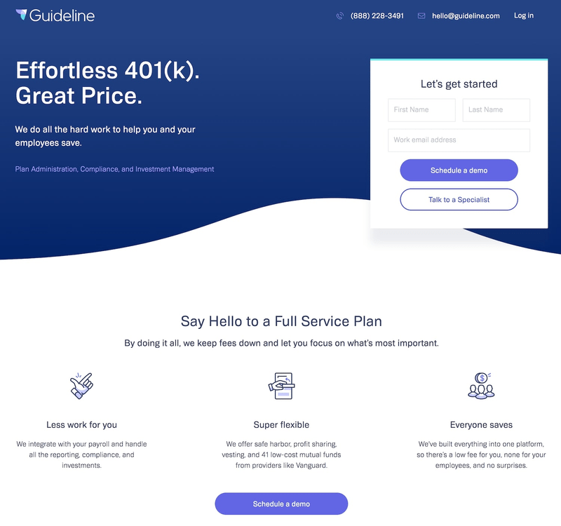

<h2 style="text-align: center">Bienvenido a Funval</h2>
Este es tu primer día en el camino a convertirte en un Desarrollador Web Full Stack, por lo que te invitamos a prestar mucha atención a todo lo que aprenderás. Toma apuntes de lo que consideres mas relevante y anota los temas que sean más complicados de entender para que puedas resolver tus dudas posteriormente.

Sin mas rodeos, comencemos 😉.

## Fundamentos de la Programación

La programación en pocas palabras, es darle datos e instrucciones a una computadora para que procese esos datos siguiendo las instrucciones que le dimos para que nos devuelva un resultado. ¿Y para qué? para resolver problemas de nuestra vida como hacer operaciones matemáticas, sacar estadísticas, automatizar procesos, etcétera.

Pero esos problemas se pueden resolver de diferentes maneras, algunas más rápidas y eficientes y otras no tanto. Pero todas con el fin de encontrar la solución al problema.

### ¿Qué es la Programación?

Es un término común que se puede describir según la Real Academia de la Lengua como "Acción o efecto de programar". ¿Y programar? se define como Idear y ordenar las acciones necesarias para realizar un proyecto.

Todo esto en términos generales, no se refiere específicamente a la programación de lenguajes informáticos, pero nos da una idea de lo que es.

Para ejecutar lo que el usuario desea hacer en su computadora, o bien para resolver un problema específico, este precisa buscar un software que realice o ejecute con exactitud la tarea que se ha planteado o elaborar y desarrollar (escribir) un programa que la realice. El trabajo de elaboración de un programa se denomina “programación”. Pero la programación no es solo el trabajo de escritura del código, sino todo un conjunto de tareas que se deben cumplir, a fin de que el código que se escribió resulte correcto, robusto, y cumpla con el objetivo o los objetivos para los que fue creado. 

Las afirmaciones que se derivan de lo anterior son varias: 

- Conocer las herramientas, los formalismos y los métodos para transformar un problema en un programa escrito en un lenguaje (que posiblemente no será el lenguaje máquina), y para qué dicho programa pueda ser transformado en un código ejecutable. 

- Saber transformar el problema inicial en un algoritmo y luego en un programa.

La primera afirmación es genérica y se considera para varias categorías de problemas para resolver. Por su parte, la segunda es específica de un problema determinado que se tiene que resolver, para lo cual existen diversas metodologías específicas de resolución para este tipo de problemas.

Para los casos de problemas muy generales, en ocasiones existen métodos conocidos que solo se adaptan a un problema en particular. El método es, por lo general, un algoritmo o una técnica de programación.

## Desarrollo Web

Web Developing
¿Y el Desarrollo Web?

La aplicación de la programación y la lógica son muchos: Inteligencia Artificial, Administración de base de datos, Desarrollo de videojuegos, Desarrollo de Sistemas operativos, etc.

Entre todas estas ramas encontramos el Desarrollo Web.

Desarrollo web es un término que define la creación de sitios web para Internet o una intranet.

El Programador Web es un profesional que trabaja con desarrolladores de páginas web, softwares, operadores de sistemas (SysOps) que ejecuta y/o desarrollar las versiones e implementaciones de códigos. El puesto requiere de personas que también posean soft skills o habilidades blandas relevantes que impacten positivamente el control de calidad de las pruebas y los equipos de operaciones; además de fomentar un entorno colaborativo. 

Dentro del Desarrollo Web encontramos distintos roles:

- **Desarrollador web front-end** es el profesional responsable de proyectar y construir la interfaz del usuario en un proyecto web. Es quien cuida de la visualización y la interfaz gráfica.

- **Desarrollador web back-end** Son los que trabajan con aplicaciones haciendo código que sólo el servidor entenderá.

- **Desarrollador web full-stack** - Por supuesto que nada impide que un desarrollador trabaje en ambas áreas. Por eso el término full-stack se refiere a que el profesional que trabaja tanto con el back-end como el front-end.

Aquí te vamos a enseñar lo necesario para que tengas las habilidades de un desarrollador Full-Stack así que ¡preparate para aprender creando! 😁.

Comenzaremos con las habilidades de un desarrollador Front-end y seguiremos con el Back-end.

Las primeras tecnologías que aprenderás son: HTML5, CSS3 y JavaScript. Los dos primeros tienen como objetivo darle estructura, contenido y diseño a una página web, y el último se encarga de la lógica que hay detrás de una página.

### Páginas web estáticas vs Dinámicas

Al empezar en el mundo del desarrollo web, seguro te estarás preguntando ¿Cómo inicio a hacer páginas web? Veamos primero las dos diferencias entre estos productos web.

### Páginas Estáticas

Lo primero, hay páginas estáticas y páginas dinámicas. Las páginas estáticas van a ser todos los productos web o todas las páginas que van a tener pura información para consumir, ya sea texto e imágenes, y que esta información no va a cambiar. Siempre va a ser la misma. Por ejemplo, algún blog post, si te metes algún blog de alguien, siempre vas a poder ver los blogs de esa persona.

Esta información raramente va a cambiar. Posiblemente van a llegar personas nuevas al equipo o se van a ir personas o van a agregar cierta información distinta de la empresa o de los productos que tienen, pero gran parte de la información se va a quedar ahí de forma estática por mucho tiempo, y si tú generas esta página, posiblemente te vayan a contactar meses después para poderte decir como "oye, queremos hacer este cambio, ahora
queremos agregar nuevas fotos o una nueva dirección de donde estamos nosotros". O "hay 2 miembros nuevos del equipo, creemos que agregue su información y su foto". Pero estas páginas siguen siendo estáticas porque la información perse nunca va a cambiar. Si tú entras, hoy vas a ver lo mismo. Si entras mañana, no va a haber algún tipo de cambio.

Lo más importante es que estas páginas no están conectadas a un servidor o a una base de datos, no necesitas generar interacción con la base de Datos porque no hay algo que generes este cambio del lado del cliente. El cliente desde el navegador no tendrá alguna interacción que le permita cambiar información de la página web, no tendrá algún login, etc.

#### Ejemplo de página estática

Las Landing page son un buen ejemplo de páginas estáticas. Como en este caso. La información que verán los clientes siempre es la misma y no cambiará a menos que se solicite. No hay opción de hacer login y esto es solo informativo.

Este tipo de páginas no es menos importante, simplemente tiene un objetivo distinto a una página dinámica y son más sencillas de construir.

### Páginas Dinámicas

Las páginas dinámicas, también conocidas como web Apps, ya dejan de ser páginas y se convierten más en aplicaciones por todas las cosas que vas a poder hacer con estas mismas.

Estas sí están conectadas a una base de Datos, por lo que el usuario, o sea nosotros a través del navegador, si podemos generar una interacción con la página o con la aplicación. Ahora se tiene que guardar cierta información o estado de lo que estemos haciendo, se esperaría poder tener un login para yo tener mi cuenta y poder guardar información. Se esperaría poder interactuar ya sea con productos si quiero comprar algo, si es que estoy viendo algo de mis seguidores en las redes, o si quiero ver a las personas que sigo.

#### Ejemplo de página dinámica

En páginas como Twitter, tú si puedes interactuar. Puedes dejarla de esa forma y dentro de unos 15 minutos si actualizas, la información será distinta. Esta página está en comunicación con el servidor para traer los nuevos cambios según el usuario lo solicite. La información que ves allí es específica para ti, y otro usuario podría ver twits distintos.

## Enlaces

[Articulo Tekla - ¿Qué es desarrollo web?](https://tekla.io/blog/que-es-desarrollo-web/)