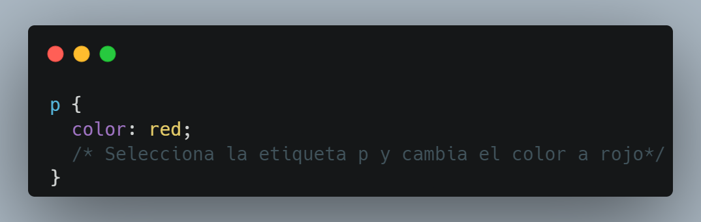
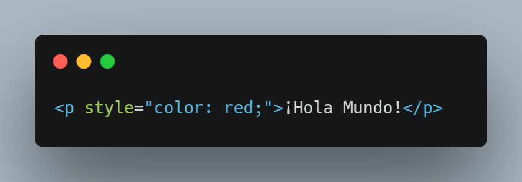
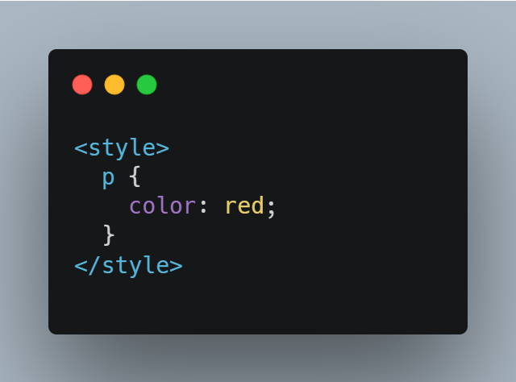
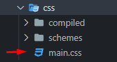
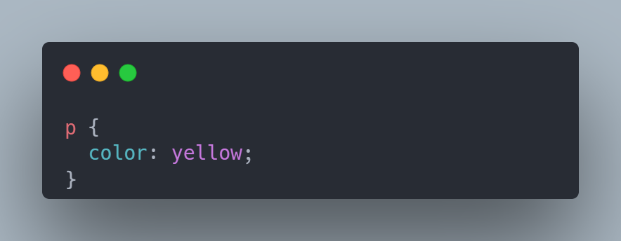
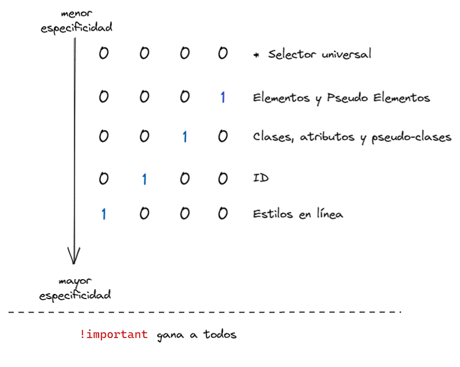
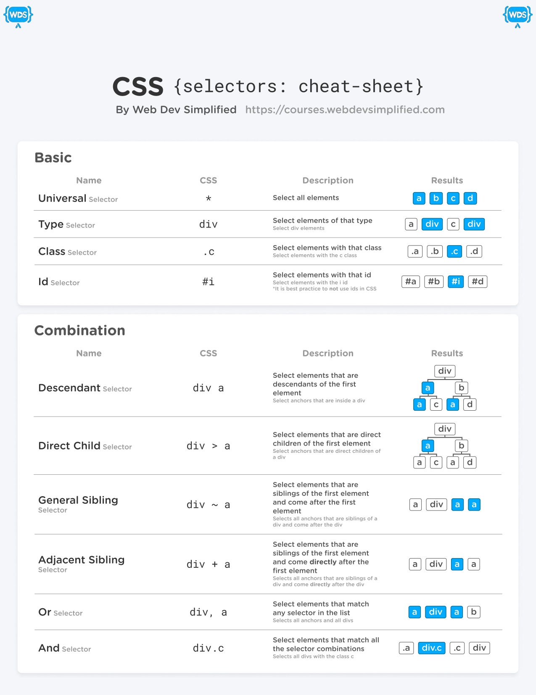
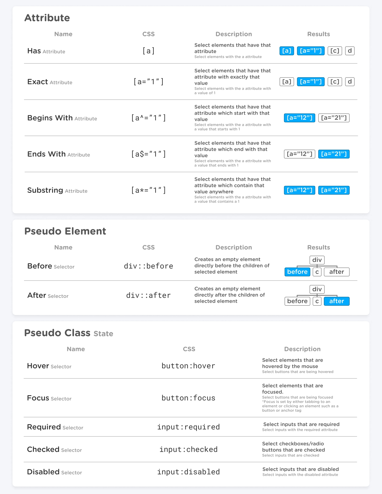
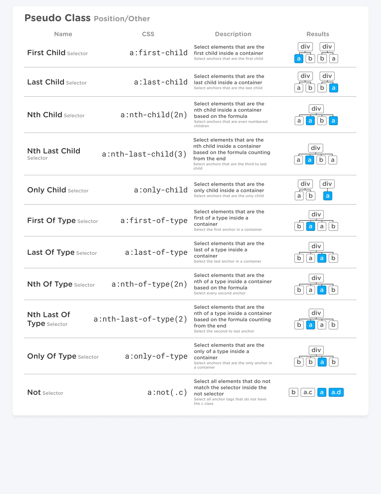

## Que es CSS?

Como HTML, CSS (Cascading Style Sheets) u Hojas de estilo en cascada en español, no es realmente un lenguaje de programación, tampoco es un lenguaje de marcado. Es un lenguaje de hojas de estilo, es decir, te permite aplicar estilos de manera selectiva a elementos en documentos HTML. Por ejemplo, para seleccionar todos los elementos de párrafo en una página HTML y volver el texto dentro de ellos de color rojo, has de escribir este CSS:



CSS nos ayuda a generar un gran cambio en nuestras páginas web y su sintáxis es distintia a HTML.

## Sintáxis 


El `selector` nos ayuda a identificar a que elemento(s) se le aplicarán los estilos.
El `bloque de declaración` es donde se escriben los estilos, tener en cuenta que se inicia y culmina con llaves `{}`.
La `declaración` es donde ajustamos una cosa de el/los elemento(s), se compone por la `propiedad` que representa lo que vamos a ajustar y el `valor` que representa como lo vamos a cambiar (Cambiaremos los elementos p, le cambiaremos el color a rojo).


## Donde escribir CSS

Hay 3 lugares o formas de escribir CSS: inline, internal y external (en línea, interno y externo).

### Inline



dentro de las etiquetas de apertura HTML podemos añadir el atributo style y como parte de su valor, podemos indicar las declaraciones CSS separadas por `;`

### Internal



dentro de la `<head>` podemos insertar la etiqueta `<style> `donde podremos ingresar nuestro codigo css. Esto trae la ventaja de usar los selectores a diferencia de los estilos inline, que se aplican a cada elemento.

### External



External hace referencia a escribir CSS en un archivo  aparte donde solo irá este código. la forma de escribir aquí sigue siendo en bloque sin la necesidad de una etiqueta `<style>`, aunque necesitamos enlazar el archivo HTML con este, por medio de una etiqueta link dentro del head similar a esta:

```html
<link rel="stylesheet" href="./css/main.css">
```

## Selectores CSS

Un selector nos permite asociar una o más declaraciones a uno o más elementos de la página.

### Selectores Básicos

Podemos apuntar a ese elemento usando este selector `p`, que apunta a todos los elementos que usan la etiqueta `p` en la página. Una regla CSS simple para lograr lo que queremos es:



Cada etiqueta HTML tiene un selector correspondiente, por ejemplo: `div`, `span`, `img`.

Si un selector coincide con varios elementos, todos los elementos de la página se verán afectados por el cambio.

Los elementos HTML tienen 2 atributos que se utilizan con mucha frecuencia en CSS para asociar el estilo a un elemento específico de la página: class y id.

Hay una gran diferencia entre esos dos: dentro de un documento HTML puede repetir el mismo valor class en varios elementos, pero solo puede usar id una vez. Asimismo, usando clases puedes seleccionar un elemento con 2 o más nombres de clase específicos, algo que no es posible usando ids.

Las clases se identifican mediante el símbolo '.' , mientras que los identificadores utilizan el símbolo '#' (numeral, hash tag).

Ejemplo usando una clase:

```html
<!-- HTML -->
<p class="dog-name">Roger</p> <!--Usamos el atributo class -->
```

```css
/* CSS */
.dog-name {
  color: yellow;
}
```


Ejemplo usando un ID:

```html
<!-- HTML -->
<p id="dog-name">Roger</p> <!--Usamos el atributo id -->
```

```css
/* CSS */
#dog-name {
  color: yellow;
}
```

<div class="flex flex-col px-4 py-2 mb-8 text-base rounded-md bg-primary-100 dark:bg-primary-900">
  <div style="gap: 1rem;" class="flex items-center ltr:pr-3 rtl:pl-3 text-primary-400">
    <span></span>
    <b>Complejidad de Selectores</b>
  </div>
  <span class="dark:text-neutral-300">
Lo que viene a continuación son conceptos más complejos de CSS, pero no es necesario que los entiendas para comenzar a usar CSS. Sin embargo, te aconsejo que le des un vistazo para que veas hasta donde puede llegar el uso de los selectores.
  </span>
</div>

### Combinando Selectores

Hasta ahora hemos visto cómo apuntar a un elemento, una clase o una identificación. Introduzcamos selectores más potentes.

#### Seleccionar Elemento con clase o ID

Puede apuntar a un elemento específico que tenga una clase o una identificación adjunta.

Ejemplo usando una clase:

```html
<p class="dog-name">Roger</p>
<p>Mauricio</p>
```

```css
p.dog-name { /* Solo seleccionamos el elemento 
p que tiene la clase dog-name */
  color: yellow; 
}
```

¿Por qué querría hacer eso, si la clase o la identificación ya proporciona una forma de apuntar a ese elemento? Puede que tengas que hacer eso para tener más especificidad. Veremos qué significa eso más tarde.

#### Apuntando a múltiples clases

Puedes apuntar a un elemento con una clase específica usando .class-name, como vio anteriormente. Puedes apuntar a un elemento con 2 (o más) clases combinando los nombres de clase separados por un punto, sin espacios.

Ejemplo:

```html
<p class="dog-name roger">Roger</p>
<p class="dog-name">Mauricio</p>
```

```css
.dog-name.roger { /* Solo seleccionamos el elemento 
que tiene la clase dog-name y la clase roger */
  color: yellow; 
}
```

#### Combinando clases e id's

De la misma manera, puede combinar una clase y una identificación.

Ejemplo:

```html
<p class="dog-name" id="roger">Roger</p>
<p class="dog-name" id="mauricio">Mauricio</p>
```

```css
.dog-name#roger { /* Seleccionamos el elemento que 
tiene la clase dog-name y el id roger */
  color: yellow; 
}
```

### Especificidad

Lo que acabamos de ver tiene un propósito importante y esto es para que evitemos aplicar estilos a elementos que no deseamos, a medida que nuestra página crezca, comenzaremos a usar estas combinaciones para tener un mejor orden en los estilos que aplicamos. Sin embargo al aplicar estos selectores, la forma en la que se aplica los estilos puede romper el orden en cascada que conocemos por un concepto llamado **especificidad**.

Para entender ese concepto mira el siguiente video donde entendemos que es la especificidad y como afecta los estilos que aplicamos a los elementos.



Aquí te dejo una tabla donde podrás ver la especificidad entre elementos y selectores:



### Más Selectores

Hay muchas más formas de combinar los selectores, aquí tienes una lista con más selectores, puedes apoyarte en el traductor de google para entender algunos terminos que vienen en ingles en las siguientes imágenes:







