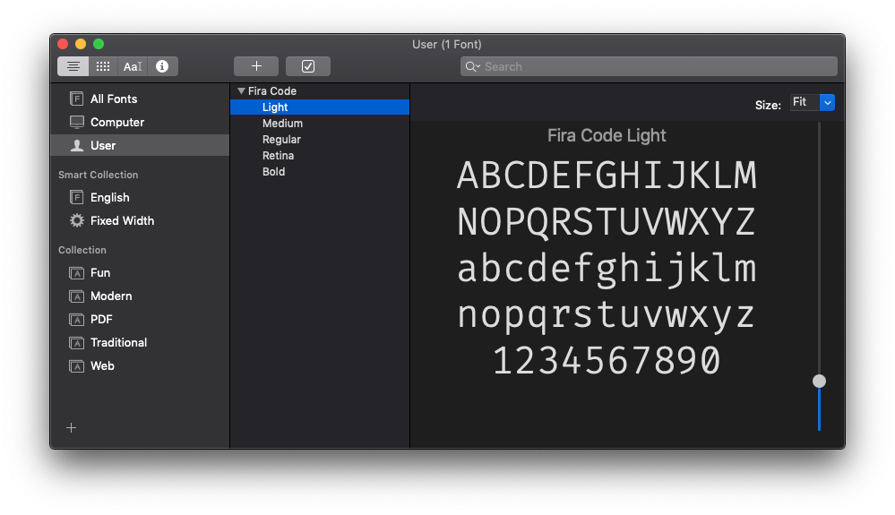
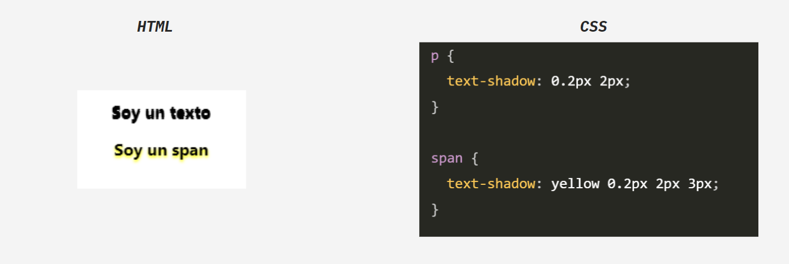

## Fuentes

En los albores de la web, solo tenía un puñado de fuentes entre las que podía elegir, afortunadamente, hoy puedes cargar cualquier tipo de fuente en tus páginas. CSS ha ganado muchas buenas capacidades a lo largo de los años en lo que respecta a las fuentes.

La propiedad font es la abreviatura de una serie de propiedades, las que veremos hoy son las siguientes:

- font-family
- font-weight
- font-style
- font-size

Veamos cada uno de ellos.

### font-family

Establece la familia de fuentes que utilizará el elemento.
¿Por qué “familia”? Porque lo que conocemos como fuente en realidad se compone de varias subfuentes. que proporcionan todo el estilo (negrita, cursiva, ligero...) que necesitamos. Aquí hay un ejemplo de la aplicación Font Book de una Mac: la familia de fuentes Fira Code alberga varias fuentes dedicadas debajo:



Esta propiedad le permite seleccionar una fuente específica, por ejemplo:

```css
body {
  font-family: Helvetica;
}
```

Puede establecer varios valores, por lo que se usará la segunda opción si la primera no se puede usar por algún motivo (si no se encuentra en la máquina o si la conexión de red para descargar la fuente falló, por ejemplo):

```css
body {
  font-family: Helvetica, Arial;
}
```

### font-weight

Esta propiedad establece el ancho de una fuente. Puede utilizar esos valores predefinidos:

- normal
- bold
- bolder (en relación con el elemento principal)
- lighter (en relación con el elemento principal)

O usando las palabras clave numéricas

- 100
- 200
- 300
- 400, asignado a normal
- 500
- 600
- 700 asignado a bold
- 800
- 900

donde 100 es la fuente más clara y 900 es la más gruesa.

### font-style

Le permite aplicar un estilo de cursiva a una fuente. Esta propiedad también permite los valores **oblique** y **normal**. Hay muy poca o ninguna diferencia entre usar **italic** y **oblique**. El primero es más fácil para mí, ya que HTML ya ofrece un elemento i que significa cursiva (italic).

```css
p {
  font-style: italic;
}
```

### font-size

Esta propiedad se utiliza para determinar el tamaño de las fuentes. Puedes pasar 2 tipos de valores: un valor de longitud como **px**, **em**, **rem**, o una palabra clave de valor pre definido.
En el Segundo caso los valores que puedes usar son:

- xx-small
- x-small
- small
- medium
- large
- x-large
- xx-large
- smaller (relativo al elemnto padre)
- larger (relativo al elemento padre)

```css 
p {
  font-size: 20px;
}

li {
  font-size: medium;
}

```

### Fuente personalizada

En ocasiones, querrás usar fuentes que no están por defecto dentro del navegador del cliente o tienes que asegurarte que la fuente que deseas usar, esté disponible para que el cliente tambien pueda renderizarla. Para esto podemos importar fuentes personalizadas a nuestro proyecto, en el siguiente video aprenderás a usar fuentes personalizadas de google a tu página web, da click en el siguiente enlace para abrir el video en youtube:

[Fuentes Personalizadas en CSS - Youtube](https://www.youtube.com/watch?v=UkbG1ofp_cQ)

## Tipografía | Texto

Ya hablamos sobre las fuentes, pero hay más en el estilo del texto. En esta sección hablaremos de las siguientes propiedades:

- text-decoration
- text-align
- line-height
- text-shadow

### text-decoration

Esta propiedad se usa para agregar decoraciones al texto, incluyendo:

- underline
- overline
- line-through
- blink
- none

```css
a {
  text-decoration: underline;
}
```

### text-align

Por defecto, la alineación del texto tiene el valor **start**, lo que significa que el texto comienza en el "inicio". Los valores posibles son **start**, **end**, **left**, **right**, **center**, **justify**(es bueno tener un espacio constante en los extremos de las líneas):

```css
p {
  text-align: center;
}
```

### line-height

Esto le permite cambiar la altura de una línea. Cada línea de texto tiene una cierta altura de fuente, pero luego hay un espacio adicional verticalmente entre las líneas. Esa es la altura de la línea. los valores que puedes utilizar son unidades de medida (**px**, **rem**, **em**, etc).

```css
p {
  line-height: 1rem;
}
```

### text-shadow

Aplica una sombra al texto. Por defecto, el texto ahora tiene sombra.

Esta propiedad acepta un color opcional y un conjunto de valores que establecen:

- el desplazamiento X de la sombra del texto
- el desplazamiento Y de la sombra del texto
- el radio de desenfoque

Si no se especifica el color, la sombra utilizará el color del texto.



Hay muchas más propiedades CSS para fuentes y textos, pero las veremos más adelanta, incluso como importar otro tipo de fuentes. Si deseas aprender más propiedades de CSS puedes ir al siguiente enlace, la página está en inglés pero puedes usar la opcion de traducir páginas que te da tu navegador:

[cssreference.io](https://cssreference.io)