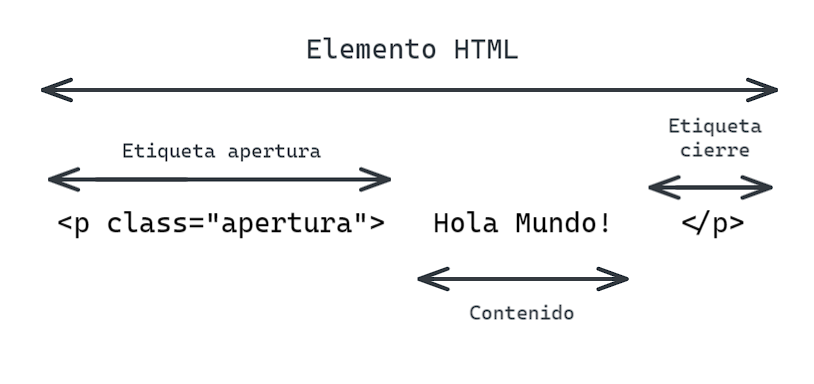


Temas de la semana 📖


## Día 1 : Introducción a HTML y CSS

Al comenzar tu camino como Web Developer (Desarrollador Web) vas a tener que aprender varias tecnologías. vamos a empezar por la base de la web. 

### HTML

HTML (Lenguaje de Marcas de Hipertexto, del inglés HyperText Markup Language) es el componente más básico de la Web. Define el significado y la estructura del contenido web. Además de HTML, generalmente se utilizan otras tecnologías para describir la apariencia/presentación de una página web (CSS) o la funcionalidad/comportamiento (JavaScript).

"Hipertexto" hace referencia a los enlaces que conectan páginas web entre sí, ya sea dentro de un único sitio web o entre sitios web. Los enlaces son un aspecto fundamental de la Web. Al subir contenido a Internet y vincularlo a las páginas creadas por otras personas, te conviertes en un participante activo en la «World Wide Web» (Red Informática Mundial).

HTML ha ido evolucionando a través del tiempo y hoy nos encontramos en la versión 5 (HTML5). Este lenguaje se basa en una estructura de etiquetas, las cuales tienen la siguiente forma:

Es más facil aprender esto haciendo, así que dejemos por un momento la teoría.

[Khan Academy : HTML](https://es.khanacademy.org/computing/computer-programming/html-css/intro-to-html/v/making-webpages-intro)

Ingresa al enlace de arriba e intenta completar las lecciónes antes de pasar al siguiente tutorial.
Una vez que realizaste el tutorial de Khan academy, te recomiendo seguir con el tutorial que verás a continuación.



HTML es la base de las páginas web, tener una idea de lo que representa y como usarlo de manera básica, te ayudará a que en un futuro puedas construir páginas web modernas y prácticas.

