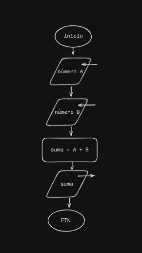

# Introducción a la Lógica de Programación

## ¿Qué es la lógica de programación?

La **lógica de programación** es la base fundamental para desarrollar software. Consiste en una serie de reglas y estructuras que permiten escribir instrucciones de manera ordenada para que una computadora pueda ejecutarlas correctamente.

## ¿Por qué es importante?

- Facilita la resolución de problemas mediante el uso de algoritmos.
- Permite escribir código más estructurado, eficiente y fácil de mantener.
- Es independiente del lenguaje de programación, lo que ayuda a aprender nuevos lenguajes con mayor facilidad.

## Conceptos básicos

### 1. Algoritmos

Un **algoritmo** es un conjunto de pasos secuenciales que resuelven un problema específico. Un buen algoritmo debe ser:

- **Preciso**: cada paso debe estar bien definido.
- **Finito**: debe terminar en algún punto.
- **Definido**: si se ejecuta varias veces con los mismos datos, debe producir el mismo resultado.

Ejemplo de un algoritmo en lenguaje natural:

1. Ingresar dos números.
2. Sumar los dos números.
3. Mostrar el resultado.

### 2. Diagramas de flujo

Los **diagramas de flujo** son representaciones gráficas de algoritmos utilizando símbolos estándar:

- **Óvalo**: Inicio o fin del programa.
- **Paralelogramo**: Entrada o salida de datos.
- **Rectángulo**: Procesos o cálculos.
- **Rombo**: Decisiones lógicas.

Ejemplo:

```
Inicio → [Ingresar número A] → [Ingresar número B] → [Sumar A + B] → [Mostrar resultado] → Fin
```



### BASES DE LA PROGRAMACIÓN

En el siguiente video podrás encontrar las bases de la lógica de programación por el canal de youtube "La Geekipedia de Ernesto".
Dentro del video se mostrará el uso simple de un programa llamado "Raptor" el cual puede ser descargado de la siguiente pagina.
<a href="https://raptor.martincarlisle.com/" target="_blank"> Raptor Descarga</a>


