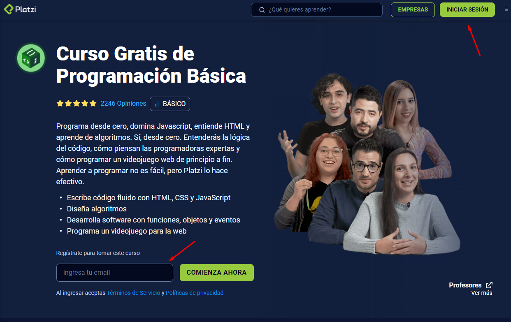
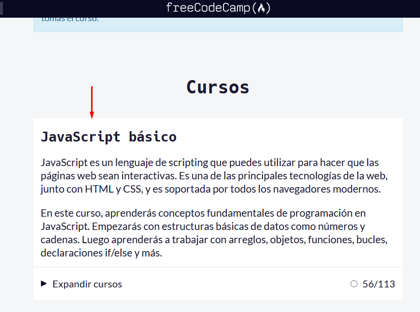

## Día 3 : JavaScript

  

    
    <b>Importancia de los temas que aprenderás</b>
  

  

  Si bien es cierto que estos temas te ayudarán a prepararte para el exámen de admisión, esperamos que puedas analizarlo y prácticar de la mano con los tutoriales que hemos añadido. Al ingresar al programa, esta información será de gran ayuda para empezar tu camino como programador, recuerda que esperamos que llegues a entender de forma básica los temas que aprenderás y al iniciar el curso, podremos profundizar en ellos. También, tendremos en cuenta que leiste estos temas y partiremos de ahí para avanzar en el curso.
  

## JavaScript en Platzi

Para estos dias, vamos a revisar el curso de Programación básica que ofrece platzi de manera gratuita:

[Programación básica - Platzi](https://platzi.com/cursos/programacion-basica/)

Puedes loguearte si ya tienes cuenta o registrarte en cualquiera de estos dos apartados:

<mark>Recuerda</mark> que debes ver almenos las **8 primeras clases** antes del zoom de hoy 😊.

## FreeCodeCamp - Recurso Adicional

Siempre lo mejor es aprender haciendo, por eso te invitamos a que te registres en [FreeCodeCamp](https://www.freecodecamp.org/), una plataforma que te permitirá aprender de manera interactiva y guiada, además de que te permitirá obtener certificaciones que te ayudarán a demostrar tus conocimientos.

especificamente vamos a revisar el curso de JavaScript que ofrece, el cual puedes encontrar en el siguiente enlace:

- [FreeCodeCamp - JavaScript](https://www.freecodecamp.org/espanol/learn/javascript-algorithms-and-data-structures/).

Por ahora te recomendamos empezar con la seccion de JavaScript Básico:

Este curso va paso a paso a entender los conceptos de JavaScript, así que puedes ir a tu propio ritmo.