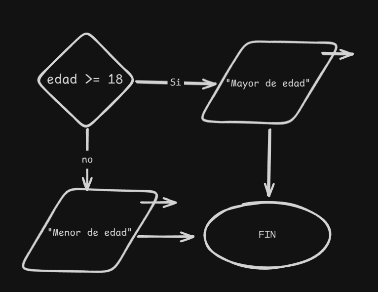
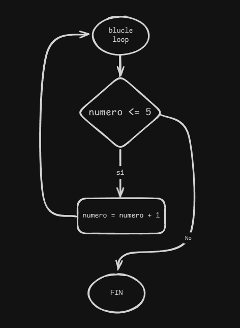

# Estructuras de Control

Las estructuras de control permiten tomar decisiones y repetir instrucciones:

## a) Condicionales (IF-ELSE)

Se usan para ejecutar diferentes bloques de código según una condición.



## b) Bucles (FOR)

Permiten repetir instrucciones varias veces.

Ejemplo con un bucle FOR:



 

# Conclusión

La lógica de programación es un pilar esencial en el desarrollo de software. Aprender a estructurar algoritmos, utilizar diagramas de flujo te ayudará a mejorar tus habilidades como programador, independientemente del lenguaje que utilices.
