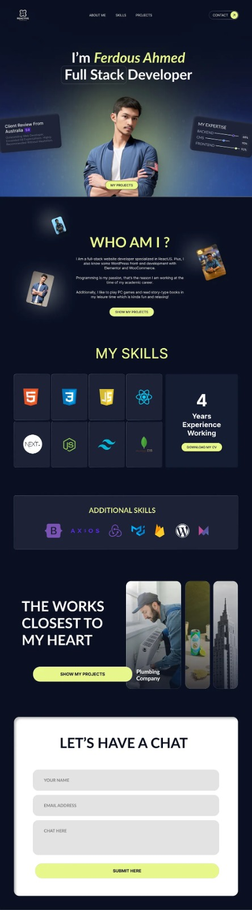

# Proyecto: Portafolio Web para Desarrollador Full Stack

## Descripción
Este proyecto consiste en la creación de un portafolio web personal para un desarrollador Full Stack. El objetivo es presentar habilidades, experiencia y proyectos de una manera profesional y atractiva. Los alumnos aprenderán a construir una página web moderna con tecnologías web populares.

## Objetivos del Proyecto
1. **Diseñar una página web moderna** utilizando HTML y CSS.
2. **Implementar una sección de habilidades y experiencia** con iconos representativos.
3. **Crear una galería de proyectos** con imágenes y descripciones.
4. **Incorporar un formulario de contacto** para que clientes o empleadores puedan comunicarse.
5. **Optimizar el diseño para distintos dispositivos** utilizando estilos responsivos.

## Tecnologías Utilizadas
- HTML
- CSS (TailwindCSS recomendado)

## Estructura del Proyecto
1. **Encabezado (Header)**
   - Logo y navegación (Inicio, Habilidades, Proyectos, Contacto)
   - Botón de contacto destacado

2. **Sección Principal (Hero Section)**
   - Foto del desarrollador
   - Nombre y especialidad destacada
   - Enlace a proyectos

3. **¿Quién soy?**
   - Breve descripción del desarrollador y su pasión por la programación
   - Imagen decorativa o tarjetas con información

4. **Sección de Habilidades**
   - Íconos de tecnologías dominadas (HTML, CSS, etc.)
   - Años de experiencia
   - Botón para descargar CV

5. **Proyectos Destacados**
   - Imágenes y descripciones de proyectos realizados
   - Enlace a más detalles o repositorio en GitHub

6. **Formulario de Contacto**
   - Campos para nombre, correo y mensaje
   - Botón de envío con estilo llamativo

## Paleta de Colores
Para mantener coherencia con el diseño, se debe utilizar la siguiente paleta de colores:

### **Colores principales:**
- **Fondo oscuro**: `#0D1117`
- **Texto principal**: `#FFFFFF`
- **Amarillo destacado**: `#E3FF6A`
- **Verde neón**: `#A4FF7A`
- **Azul oscuro**: `#1E293B`
- **Gris suave**: `#8892B0`

### **Gradiente principal:**
```css
background: linear-gradient(135deg, #1E293B 0%, #0D1117 100%);
```

### **Configuración en TailwindCSS**
En el archivo `tailwind.config.js`:
```js
module.exports = {
  theme: {
    extend: {
      colors: {
        dark: "#0D1117",
        light: "#FFFFFF",
        highlight: "#E3FF6A",
        neonGreen: "#A4FF7A",
        deepBlue: "#1E293B",
        softGray: "#8892B0",
      },
      backgroundImage: {
        "gradient-main": "linear-gradient(135deg, #1E293B 0%, #0D1117 100%)",
      },
    },
  },
  plugins: [],
};
```

### **Uso en CSS estándar**
```css
:root {
  --color-dark: #0D1117;
  --color-light: #FFFFFF;
  --color-highlight: #E3FF6A;
  --color-neon-green: #A4FF7A;
  --color-deep-blue: #1E293B;
  --color-soft-gray: #8892B0;
  
  --gradient-main: linear-gradient(135deg, #1E293B 0%, #0D1117 100%);
}

body {
  background: var(--color-dark);
  color: var(--color-light);
}

.button {
  background: var(--color-highlight);
  color: var(--color-dark);
}

.section {
  background: var(--gradient-main);
}
```

## Pasos para Implementarlo
1. **Configurar el proyecto**
   - Crear una carpeta para el proyecto
   - Instalar TailwindCSS si se desea estilizar con esta herramienta

2. **Estructurar el HTML**
   - Crear los componentes o secciones necesarias
   - Usar etiquetas semánticas para una mejor accesibilidad

3. **Estilizar la Página**
   - Aplicar estilos base con CSS o TailwindCSS
   - Definir un esquema de colores atractivo

4. **Optimización y Despliegue**
   - Probar en diferentes dispositivos y navegadores
   - Subir el proyecto a GitHub y desplegar en Vercel o Netlify

## Recursos Adicionales
- [Guía de TailwindCSS](https://tailwindcss.com/docs)

¡Con esto, los alumnos podrán crear su propio portafolio y mostrar sus habilidades al mundo!



