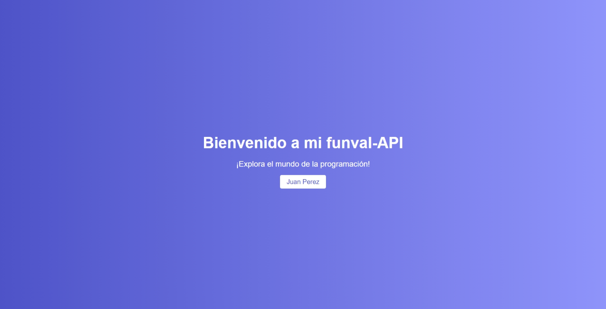

## Mini Proyecto: API de Usuarios con Node.js y MySQL

El objetivo de este mini proyecto es crear una API en Node.js que sirva datos de usuarios en formato JSON, utilizando el módulo http. La API también debe ser capaz de exportar los datos de usuarios a un archivo CSV y de importar datos de usuarios desde un archivo CSV a una base de datos MySQL.

### Especificaciones

1. **Ruta `/`**:

   - Esta ruta muestra un archivo html con una interfaz sencilla al usuario:
   - Ejemplo:
     
     [Ver imagen](image.png)

2. **Ruta `/api/usuarios`**:

   - Esta ruta devolverá una lista de usuarios en formato JSON.
   - Cada usuario debe contener los siguientes campos:
     - id (identificador único del usuario)
     - nombres
     - apellidos
     - dirección
     - correo electrónico
     - dni (Documento Nacional de Identidad)
     - edad
     - fecha_creacion (fecha de creación del usuario)
     - telefono
     - (otros campos pueden ser agregados según necesidad)

3. **Ruta `/api/usuarios/export`**:

   - Esta ruta se encargará de exportar los datos de usuarios a un archivo CSV llamado "usuarios.csv".
   - El archivo CSV debe contener una fila de encabezados con los nombres de los campos: `id`, `nombres`, `apellidos`, `direccion`, `correo`, `dni`, `edad`, `fecha_creacion`, `telefono`.
   - Cada fila subsiguiente del archivo CSV debe contener los datos de un usuario.

   - **Ejemplo de Archivo CSV Exportado ("usuarios.csv"):**

   ```cs
   id,nombres,apellidos,direccion,correo,dni,edad,fecha_creacion,telefono
   1,John,Doe,Calle Falsa 123,john@example.com,12345678,30,2024-03-01,123-456-7890
   2,Jane,Smith,Avenida Principal 456,jane@example.com,87654321,25,2024-03-01,987-654-3210
   3,Alice,Johnson,Plaza Central 789,alice@example.com,13579246,35,2024-03-01,456-789-0123
   ```

4. **Ruta `/api/usuarios/import`**:

   - Esta ruta se encargará de leer el archivo "usuarios.csv" y guardar los datos en la base de datos MySQL.
   - Se debe comprobar que los datos que se están guardando no estén repetidos en cuanto al id y al correo electrónico. No se deben subir filas repetidas.
   - Se pueden manejar errores como archivos no encontrados, formatos incorrectos, etc.
   - Además, se implementará una validación de datos para asegurar que los campos requeridos estén presentes y que tengan el formato adecuado (por ejemplo, validar el formato del correo electrónico).
   - Se implementarán medidas de seguridad para proteger la API contra ataques comunes como inyecciones SQL. Se utilizarán consultas preparadas o consultas parametrizadas para evitar este tipo de ataques. Ejemplo:

   ```js
   try {
     // Definir la consulta preparada
     const sql = "SELECT * FROM usuarios WHERE nombre = ?";

     // Ejecutar la consulta preparada con el parámetro proporcionado
     const nombre = "Juan";
     const result = await pool.execute(sql, [nombre]);

     // Obtener las filas resultantes de la consulta
     const rows = result[0];

     // Liberar la conexión
     connection.release();
   } catch (error) {
     // Manejar cualquier error que pueda ocurrir durante la consulta
     console.error("Error al consultar usuario:", error);
     throw error;
   }
   ```

- Se mejorará el manejo de errores para proporcionar mensajes de error descriptivos y útiles en caso de que ocurran problemas durante la exportación o importación de datos.

### Duración del Proyecto

El proyecto tiene una duración estimada de 1 semana, durante las cuales se espera que trabajes en la implementación de las funcionalidades descritas anteriormente, así como en la integración de mejoras de tu propia iniciativa. Se te recomienda utilizar el tiempo dedicado para esto, y aún más de ser necesario.
