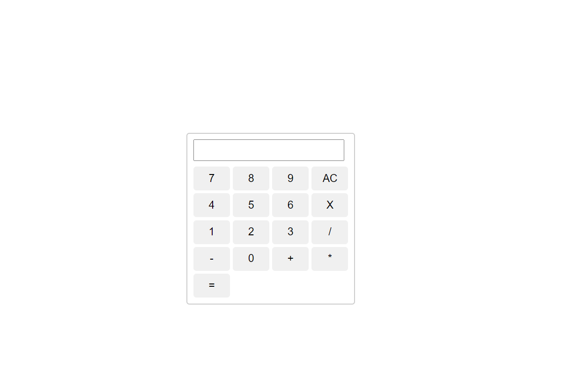

El objetivo de esta práctica es desarrollar y agregar funcionalidad a una calculadora similar a la que se muestra en la imagen proporcionada. Utilizarás **HTML**, **CSS**, **Bootstrap 5** y **JavaScript**.

## Parte 1: Diseño

En esta primera parte, crearás únicamente el **diseño** de la calculadora.

### Instrucciones:

1. **Estructura básica:**

   - Utiliza **HTML** para crear la estructura de la calculadora, que debe incluir un campo de entrada y botones para los números y operadores.
   - Organiza los botones en una cuadrícula similar a una calculadora.
   - Ejemplo:
     

2. **Estilos y diseño:**
   - Utiliza **CSS** y **Bootstrap 5** para darle estilo a la calculadora. Asegúrate de que los botones tengan bordes redondeados y un espaciado adecuado.
   - La calculadora debe ser **responsiva** y adaptarse correctamente a diferentes tamaños de pantalla (móviles, tabletas y escritorio).
   - Puedes agregarle más estilos como colores, tamaños de fuente, etc.

---

## Parte 2: Funcionalidad

En esta segunda parte, agregarás la **funcionalidad** a la calculadora que diseñaste en la Parte 1 utilizando **JavaScript**.

### Instrucciones:

1. **Agregar la funcionalidad:**

   - Implementa la lógica para que los botones numéricos y de operación actualicen el campo de entrada al hacer clic.
   - Debes implementar las operaciones básicas: suma, resta, multiplicación, división y un botón **AC** para limpiar el campo de entrada.
   - Implementa la funcionalidad para que el botón **=** realice la operación y muestre el resultado en la pantalla.

2. **Manejo de errores:**

   - Si hay una operación inválida o un error en el cálculo, muestra un mensaje adecuado en el campo de entrada.

3. **Ejemplo de funcionalidad:**

   - [Click aquí para ver video de funcionalidad](https://funvalintenacional-my.sharepoint.com/:v:/g/personal/jorgesosa_funvalinternacional_org/EbRarRgKZIZBhgGFBHeaJpQBd5JhFqcEVxWiUwKG6VVp3A?nav=eyJyZWZlcnJhbEluZm8iOnsicmVmZXJyYWxBcHAiOiJTdHJlYW1XZWJBcHAiLCJyZWZlcnJhbFZpZXciOiJTaGFyZURpYWxvZy1MaW5rIiwicmVmZXJyYWxBcHBQbGF0Zm9ybSI6IldlYiIsInJlZmVycmFsTW9kZSI6InZpZXcifX0%3D&e=MVPNE1)

## Entregables:

- Tienes 2 días para realizar esta práctica calificada.
- Sube un archivo `.zip` que contenga los siguientes archivos:
  - `index.html` (estructura HTML)
  - `styles.css` (estilos personalizados)
  - `script.js` (archivo JavaScript con la funcionalidad)
