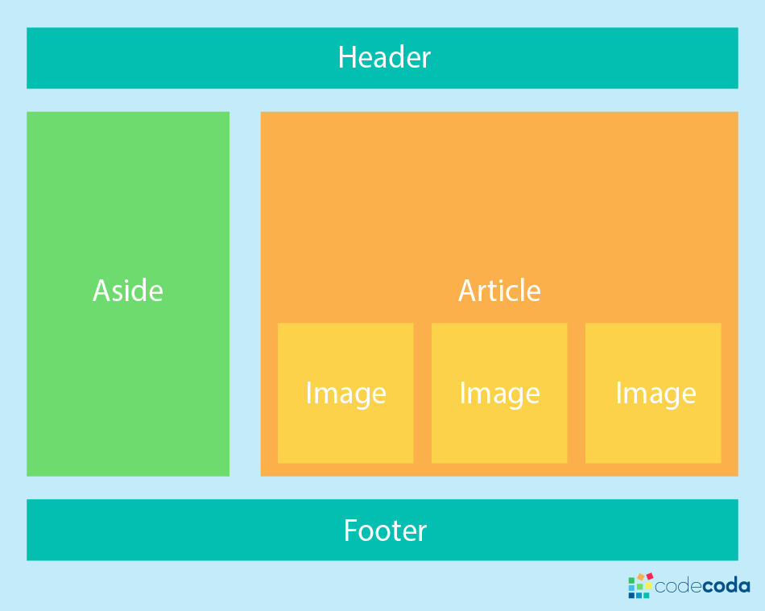

En esta práctica calificada, tendrás que utilizar Flexbox para recrear una interfaz basada en una imagen que te proporcionaremos.

### Instrucciones

1. **Analiza la imagen:** Aquí se te muestra la interfaz que debes recrear.
   
2. **Analiza la estructura:** Identifica los diferentes elementos que componen la interfaz en la imagen y cómo se relacionan entre sí.
3. **Crea el HTML:** Estructura tu HTML utilizando etiquetas semánticas para representar los elementos de la interfaz.
4. **Aplica Flexbox:** Utiliza las propiedades de Flexbox para posicionar y alinear los elementos de acuerdo al diseño en la imagen.
5. **Añade estilos adicionales:** Personaliza el diseño con colores, tipografías y otros estilos CSS según lo que se muestra en la imagen.

### Milla extra

- **Animaciones:** Agrega animaciones simples a tu diseño utilizando CSS.
- **Interactividad:** Haz que algunos elementos de tu diseño sean interactivos.
- **Optimización para dispositivos móviles:** Tu diseño podría funcionar en dispositivos móviles.

---

### Entregables

- Crea un archivo `.zip` que contenga lo siguiente:
  - `index.html` (el código HTML de tu página)
  - `styles.css` (los estilos CSS aplicados)

Sube el archivo comprimido `.zip` como entrega de la práctica.
