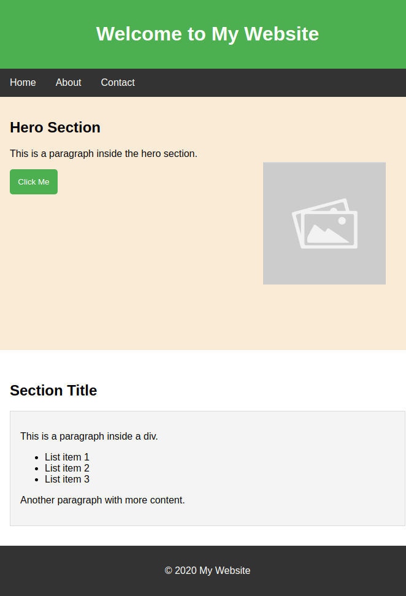

El propósito de este sitio es practicar lo que has aprendido hoy sobre HTML y CSS. Aquí podrás aplicar los conceptos aprendidos y mejorar tus habilidades de desarrollo web mediante la creación de una página web simple.

## Objetivos

- Practicar la estructura básica de un documento HTML.
- Aplicar estilos CSS para mejorar la presentación visual.
- Entender la relación entre HTML y CSS.

## Requerimientos

- Header con un título.
- Nav con una lista de al menos 3 elementos.
- Main con al menos 2 secciones.
- Sección hero con un título, un párrafo, un botón y una imagen. La imagen debe tener un ancho de 200px y estar alineada en el centro verticalmente y a la derecha horizontalmente. (Pista: usa `position: absolute`).
- Sección con un título, un párrafo, una lista y otro párrafo.
- Footer con un mensaje de derechos reservados.

#### Este es un ejemplo del resultado esperado:

### Entregables
- Enlace del despliegue del proyecto en Netlify
   
