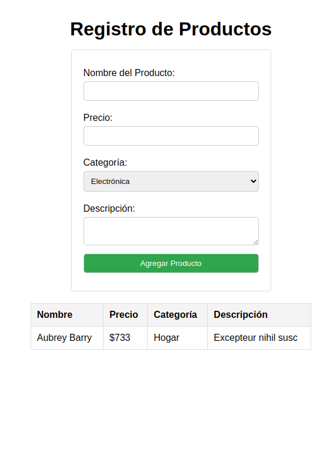

## Propósito:
Este ejercicio tiene como objetivo practicar lo que hemos aprendido acerca de box-model, table y form.

Crearás un formulario para registrar productos, y al enviarlo, los datos se agregarán dinámicamente a una tabla sin recargar la página.


### Estructura del Proyecto
```
📁 ejercicio-formulario/
├── 📄 index.html (Estructura del formulario y la tabla)
└── 📁 src/
    ├── 📁 styles/
    |   └──📄 styles.css (Aplicación del Box Model)
    └── 📁 scripts/
        └── 📄 script.js (Captura y muestra los datos en la tabla) Este archivo te lo encontraras en los recursos
```

#### Instrucciones
1. Crea un formulario con los siguientes campos:
    - Nombre del producto - `id: name`
    - Precio - `id: price`
    - Categoria - `<select>` - agrega diferentes opciones. - `id: category`
    - Descripción - `id: description`

*Nota:* El formulario debe tener el `id: productForm`

2. Crea una tabla con las siguientes columnas:
    - Nombre del producto
    - Precio
    - Categoria
    - Descripción

*Nota:* Agrega un `id: productTableBody` al <tbody>

3. Agrega un botón al formulario que, al ser presionado, capture los datos ingresados y los muestre en la tabla sin recargar la página.

4. Aplica estilos al formulario y a la tabla utilizando CSS para mejorar su apariencia. No olvides enlazar el archivo *styles.css* utilizando la etiqueta `<Link>`.

5. Copia y pega esta linea de codigo antes de la etiqueta `</head>`
```js 
    <script src="./src/scripts/script.js" defer></script>
```

6. Prueba el formulario y la tabla para asegurarte de que funcionan correctamente y que los datos se muestran como se espera. (El archivo script que te hemos proporcionado te ayudara con la captura de datos siempre y cuando hayas seguido todas las instrucciones.)

#### Recursos
<a href="script.js" download="script.js">Descarga el archivo de JavaScrip Aqui</a>

#### Este es un ejemplo del resultado esperado:



### Entregables
- Enlace del despliegue del proyecto en Netlify
   
