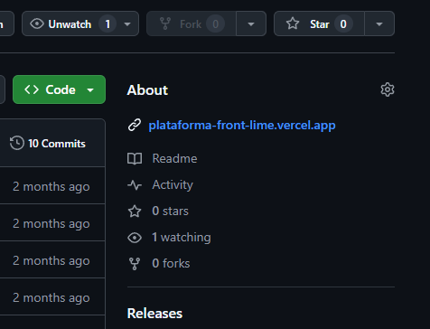

En esta práctica calificada, trabajarás en el desarrollo de una página de equipo (**Team Page**) utilizando **React** y **TailwindCSS**. El objetivo es que la página muestre un listado de miembros del equipo, sus roles y otra información relevante, siguiendo el desafío de [Team Page Challenge](https://legacy.devchallenges.io/challenges/hhmesazsqgKXrTkYkt0U).

## Instrucciones

1. **Accede al desafío:**  
   Ve al siguiente enlace: [Team Page Challenge](https://legacy.devchallenges.io/challenges/hhmesazsqgKXrTkYkt0U) y revisa los detalles del reto.

2. **Diseño de la Página:**

   - Crea una página en **React** que muestre la información de un equipo (nombre, foto, rol, descripción, etc.) tal como se muestra en el reto.
   - Diseña una estructura ordenada, donde cada miembro del equipo esté representado con una **card** o sección individual.

3. **Estilos con TailwindCSS:**

   - Utiliza **TailwindCSS** para aplicar estilos a la página.
   - Asegúrate de que la página sea **responsive**, ajustándose correctamente a distintos tamaños de pantalla.

4. **Funcionalidad Dinámica (Opcional):**
   - Si es posible, utiliza un archivo JSON o un array en tu estado para listar dinámicamente a los miembros del equipo, en lugar de hardcodearlos en el JSX.

---

### Entregables

- Tienes 2 días para realizar esta práctica calificada.
- Link a tu repositorio de GitHub, el cual debe contener el código del proyecto. Además, debe incluir el link a la página desplegada en el apartado **"About"** del repositorio. Como se muestra a continuación:
  
