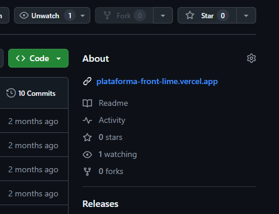

En esta práctica calificada, trabajarás en el desarrollo de una página de equipo (**Team Page**) utilizando **React** y **TailwindCSS**. El objetivo es que la página muestre un listado de miembros del equipo, sus roles y otra información relevante.

## Instrucciones

1. **Recursos:**  
- [Descarga el archivo .zip con los recursos iniciales aquí](./recursos.zip) 

- **Carpeta `design`:**  
   Contiene capturas del diseño esperado para la página. Úsalo como referencia para implementar la estructura y estilos.

- **Carpeta `images`:**  
   Incluye imágenes de cada miembro del equipo que puedes utilizar en las tarjetas o secciones individuales.

2. **Diseño de la Página:**

   - Crea una página en **React** que muestre la información de un equipo (nombre, foto, rol, descripción, etc.) tal como en las capturas del diseño proporcionado.
   - Diseña una estructura ordenada, donde cada miembro del equipo esté representado con una **card** o sección individual.

3. **Estilos con TailwindCSS:**

   - Utiliza **TailwindCSS** para aplicar estilos a la página.
   - Asegúrate de que la página sea **responsive**, ajustándose correctamente a distintos tamaños de pantalla.

4. **Funcionalidad Dinámica (Opcional):**
   - Si es posible, utiliza un archivo JSON o un array en tu estado para listar dinámicamente a los miembros del equipo, en lugar de hardcodearlos en el JSX.

---
## Observaciones 

### Requisitos Adicionales

- **Modo Oscuro (Opcional):**  
   Puedes implementar el diseño en modo oscuro o claro, según prefieras. Si decides incluir ambos modos, asegúrate de que el cambio entre ellos sea funcional y fluido.

- **Uso de Props:**  
   Es obligatorio utilizar **props** para pasar información entre componentes. Esto ayudará a mantener el código modular y reutilizable.

- **Uso de Componentes:**  
   Divide tu proyecto en múltiples componentes. No concentres todo el código en el archivo `App.jsx`. Por ejemplo:
   - Un componente para las **cards** de los miembros del equipo.
   - Agrega cualquier otro componente que consideres conveniente.

- **Buenas Prácticas:**  
   - Mantén el código limpio y organizado.
   - Utiliza nombres descriptivos para tus componentes y variables.
   - Incluye comentarios donde sea necesario para explicar partes importantes del código.
---

## Entregables

- Tienes 2 días para realizar esta práctica calificada.
- Link a tu repositorio de GitHub, el cual debe contener el código del proyecto. Además, debe incluir el link a la página desplegada en el apartado **"About"** del repositorio. Como se muestra a continuación:
  
