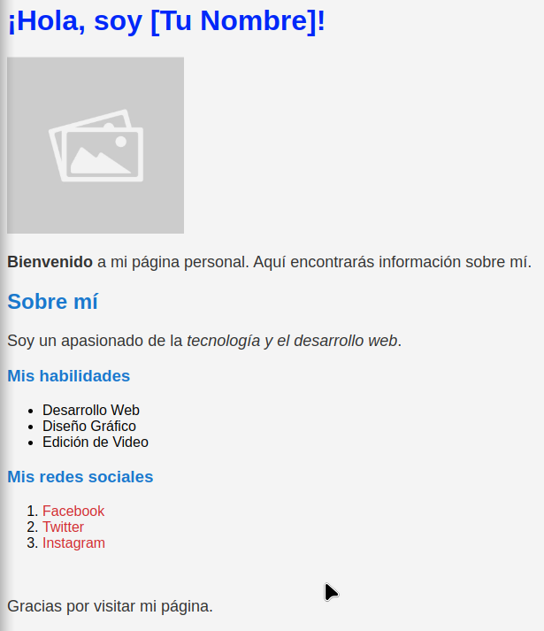

# Descripción del Proyecto

Crearás una página web básica con HTML y CSS en la que te presentarás, incluyendo tu nombre, una breve descripción sobre ti, tus intereses y enlaces a tus redes sociales.

## Estructura del Proyecto

### 1. HTML
- Usarás encabezados `<h1>` a `<h6>` para organizar el contenido.
- Párrafos `
` para describirte.
- Listas `<ul>` o `<ol>` para enumerar tus hobbies o habilidades.
- Etiqueta `<a>` para enlazar redes sociales.
- Negritas `<strong>` y cursivas `<em>` para resaltar texto.
- Saltos de línea ` ` donde sea necesario.

### 2. CSS
- Aplicarás un background usando el atributo `style` a la etiqueta `<body>`, la etiqueta `<style>` dentro de `<head>` la usaras ara aplicar estilos a las etiquetas `<h1>` y `
`, y en un archivo externo enlazado con `<link>` aplicaras el resto de los estilos.
- Cambiarás colores con `color` y `background-color`.
- Ajustarás tamaños de fuente con `font-size`.
- Utiliza los atributos `width` y `height` para definir el tamaño de la image. 

#### Este es un ejemplo del resultado esperado:

 

### Entregables
- Enlace del despliegue del proyecto en Netlify
   
