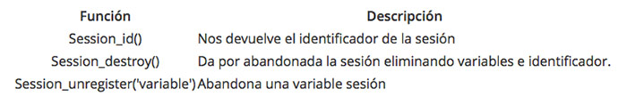

## Por qué necesitamos variables de sesión en PHP

En los programas que hemos visto hasta ahora, hemos utilizado variables que sólo existían en el archivo que era ejecutado. Cuando cargábamos otra página distinta, los valores de estas variables se perdían a menos que nos tomásemos la molestia de pasarlos por la URL o inscribirlos en las cookies o en un formulario para su posterior explotación. Estos métodos, aunque útiles, no son todo lo prácticos que podrían en determinados casos en los que la variable que queremos conservar ha de ser utilizada en varias páginas diferentes y distantes los unos de los otros.

Podríamos pensar que ese problema puede quedar resuelto con las cookies ya que se trata de variables que pueden ser invocadas en cualquier momento. El problema, ya lo hemos dicho, es que las cookies no son aceptadas ni por la totalidad de los usuarios ni por la totalidad de los navegadores lo cual implica que una aplicación que se sirviera de las cookies para pasar variables de un archivo a otro no sería 100% infalible. Es importante a veces pensar en "la inmensa minoría", sobre todo en aplicaciones de comercio electrónico donde debemos captar la mayor cantidad de clientes posibles y nuestros scripts deben estar preparados ante cualquier eventual deficiencia del navegador del cliente.

Nos resulta pues necesario el poder declarar ciertas variables que puedan ser reutilizadas tantas veces como queramos dentro de una misma sesión. Imaginemos un sitio multilingüe en el que cada vez que queremos imprimir un mensaje en cualquier página necesitamos saber en qué idioma debe hacerse. Podríamos introducir un script identificador de la lengua del navegador en cada uno de los archivos o bien declarar una variable que fuese valida para toda la sesión y que tuviese como valor el idioma reconocido en un primer momento.

Pensemos también en un carrito de la compra de una tienda virtual donde el cliente va navegando por las páginas del sitio y añadiendo los artículos que quiere comprar a un carrito. Este carrito podría ser perfectamente una variable de tipo array (tabla) que almacena para cada referencia la cantidad de artículos contenidos en el carrito. Esta variable debería ser obviamente conservada continuamente a lo largo de todos los scripts.


Aunque ya queda muy lejos, en PHP3 no existía un mecanismo de trabajo con sesiones y por tanto la diferencia mayor es que los desarrolladores estaban obligados a gestionar ellos mismos las sesiones definir sus propios identificadores de sesión.


## La sesión en PHP

Las sesiones, en aplicaciones web realizadas con PHP y en el desarrollo de páginas web en general, nos sirven para almacenar información que se memorizará durante toda la visita de un usuario a una página web. Dicho de otra forma, un usuario puede ver varias páginas durante su paso por un sitio web y con sesiones podemos almacenar variables que podremos acceder en cualquiera de esas páginas.

Digamos que las sesiones son una manera de guardar información, específica para cada usuario, durante toda su visita. Cada usuario que entra en un sitio abre una sesión, que es independiente de la sesión de otros usuarios. En la sesión de un usuario podemos almacenar todo tipo de datos, como su nombre, productos de un hipotético carrito de la compra, preferencias de visualización o trabajo, páginas por las que ha pasado, etc. Todas estas informaciones se guardan en lo que denominamos variables de sesión.

PHP dispone de un método bastante cómodo de guardar datos en variables de sesión, y de un juego de funciones para el trabajo con sesiones y variables de sesión.

Para cada usuario PHP internamente genera un identificador de sesión único, que sirve para saber las variables de sesión que pertenecen a cada usuario. Para conservar el identificador de sesión durante toda la visita de un usuario a una página PHP almacena la variable de sesión en una cookie, o bien la propaga a través de la URL.

En otras palabras, una sesión es considerada como el intervalo de tiempo empleado por un usuario en recorrer nuestras páginas hasta que abandona nuestro sitio o deja de actuar sobre él durante un tiempo prolongado o bien, sencillamente, cierra el navegador.

## Trabajo con sesiones en PHP

Cuando queremos utilizar variables de sesión en una página tenemos que iniciar la sesión con la siguiente función:

### session_start ()

Inicia una sesión para el usuario o continúa la sesión que pudiera tener abierta en otras páginas. Al hacer `session_start()` PHP internamente recibe el identificador de sesión almacenado en la cookie o el que se envíe a través de la URL. Si no existe tal identificador se sesión, simplemente lo crea.

Una vez inicializada la sesión con `session_start()` podemos a partir de ahora utilizar variables de sesión, es decir, almacenar datos para ese usuario, que se conserven durante toda su visita o recuperar datos almacenados en páginas que haya podido visitar.

La sesión se tiene que inicializar antes de escribir cualquier texto en la página. Esto es importante y de no hacerlo así corremos el riesgo de recibir un error, porque al iniciar la sesión se deben leer las cookies del usuario, algo que no se puede hacer si ya se han enviado las cabeceras del HTTP.

Una vez iniciada la sesión podemos utilizar variables de sesión a través de `$_SESSION`, que es un array asociativo, donde se accede a cada variable a partir de su nombre, de este modo:

```php
$_SESSION["nombre_de_variable"]
```


Nota: `$_SESSION` es una variable global que existe a partir de PHP 4.1.0. Lo normal es que podamos acceder a esa variable normalmente, pero si nuestra versión de PHP no está actualizada podemos intentarlo con $HTTP_SESSION_VARS, que es también un array asociativo, aunque no es de ámbito global. Si $HTTP_SESSION_VARS tampoco funciona tendremos que registrar cada variable por separado con la función session_register(), enviándo por parámetro los nombres de las variables de sesión que desea utilizar desde PHP.


### Ejemplo de código para definir una variable de sesión

```php
<?php
session_start();
$_SESSION["mivariabledesesion"] = "Hola este es el valor de la variable de sesión";
?>
```

Como se puede ver, es importante inicializar la sesión antes de hacer otra cosa en la página. Luego podremos definir variables de sesión en culquier lugar del código PHP de la página.

Para leer una variable de sesión se hace a través del mismo array asociativo $\_SESSION. Es tan sencillo como haríamos para utilizar cualquier otra variable, lo único es que tenemos que haber inicializado la sesión previamente. Y por supuesto, que la variable que deseamos acceder exista previamente.

```php
<php
session_start();
echo $_SESSION["mivariabledesesion"];
?>
```

Como se puede ver, al inicio del código hemos inicializado la sesión y luego en cualquier parte del código podríamos acceder a las variables de sesión que tuviésemos creadas.


Nota: si intentamos acceder a una variable de sesión con $\_SESSION que no ha sido creada obtendremos otro mensaje de error: Notice: Undefined index: mivariabledesesion, que es el mismo que si intentamos acceder a cualquier elemento de un array que no existe.


## Más sobre sesiones en PHP

Las variables de sesión se diferencian de las variables clásicas en que éstas residen en el servidor, son especificas de un solo usuario definido por un identificador y pueden ser utilizadas en la globalidad de nuestras páginas.

Las sesiones han de ser iniciadas al principio de nuestro script. Antes de abrir cualquier etiqueta o de imprimir cualquier cosa. En caso contrario recibiremos un error.

La siguiente información sobre sesiones de PHP también puede ser de útil lectura. No obstante lo expresado hasta aquí es una información mucho más actualizada. En las próximas líneas se explican mecanismos para sesiones pero todos los que se comentan, aunque son válidos, no son actuales por tratarse de explicaciones para versiones de PHP más antiguas.

Para iniciar una sesión podemos hacerlo de dos formas distintas:

- Declaramos abiertamente la apertura de sesión por medio de la función `session_start()`. Esta función crea una nueva sesión para un nuevo visitante o bien recupera la que está siendo llevada a cabo.

- Declaramos una variable de sesión por medio de la función `session_register('variable')`. Esta función, además de crear o recuperar la sesión para la página en la que se incluye también sirve para introducir una nueva variable de tipo sesión.

Con lo visto, vamos a proponer el ejemplo clásico de utilización de una sesión: un contador. Este contador deberá aumentar de una unidad cada vez que recargamos la página o apretamos al enlace:

```
<?php
session_register('contador');
?>
<HTML>
    <HEAD>
        <TITLE>contador.php</TITLE>
    </HEAD>
    <BODY>
        <?php
            if (isset($contador)==0) {
            $contador=0;
            }
            ++$contador;
            echo "<a href="contador.php">Has recargado esta página $contador veces</a>";
        ?>
    </BODY>
</HTML>
```

La condición if tiene en cuenta la posibilidad de que la variable $contador no haya sido todavía inicializada. La función isset se encarga de dar un valor cero cuando una variable no ha sido inicializada.

Otras funciones útiles para la gestión de sesiones son:



## Video de refuerzo

