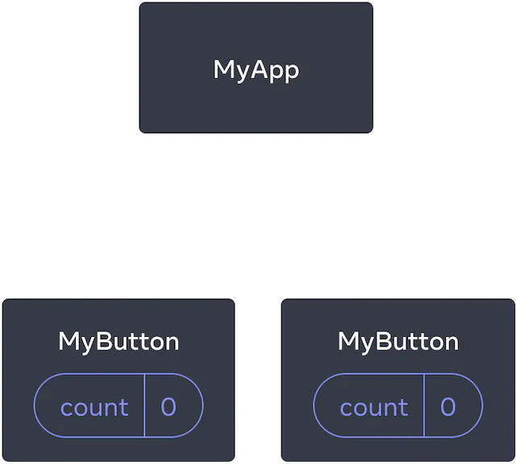
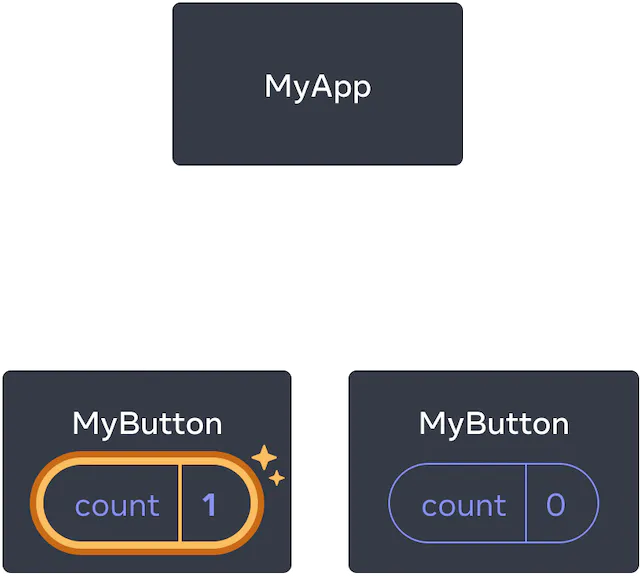
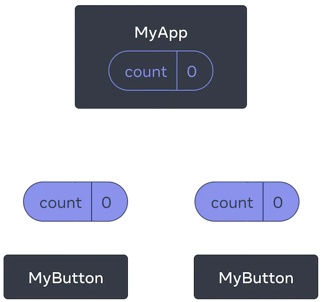
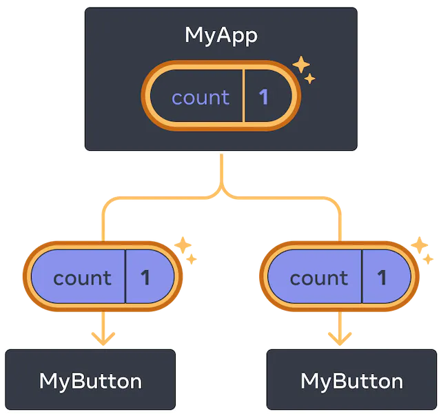

## Responder a eventos 
Puedes responder a eventos declarando funciones controladoras de eventos dentro de tus componentes:
```js
function MyButton() {
  function handleClick() {
    alert('¡Me presionaste!');
  }

  return (
    <button onClick={handleClick}>
      Presióname
    </button>
  );
}
```
¡Nota que onClick={handleClick} no tiene paréntesis al final! No llames a la función controladora de evento: solamente necesitas pasarla hacia abajo. React llamará a tu controlador de evento cuando el usuario haga clic en el botón.
## Actualizar la pantalla 
A menudo, querrás que tu componente «recuerde» alguna información y la muestre. Por ejemplo, quizá quieras contar el número de veces que se hace clic en un botón. Para lograrlo, añade estado a tu componente.

Primero, importa [useState](https://es.react.dev/reference/react/useState) de React:
```
import { useState } from 'react';
```
Ahora puedes declarar una variable de estado dentro de tu componente:
```JS
function MyButton() {
  const [count, setCount] = useState(0);
  // ...
```
Obtendrás dos cosas de useState: el estado actual (count), y la función que te permite actualizarlo (setCount). Puedes nombrarlos de cualquier forma, pero la convención es llamarlos algo como [something, setSomething].

La primera vez que se muestra el botón, count será 0 porque  pasaste 0 a useState(). Cuando quieras cambiar el estado llama a setCount() y pásale el nuevo valor. Al hacer clic en este botón se incrementará el contador:
```JS
function MyButton() {
  const [count, setCount] = useState(0);

  function handleClick() {
    setCount(count + 1);
  }

  return (
    <button onClick={handleClick}>
      Presionado {count} veces
    </button>
  );
}
```
React llamará de nuevo a la función del componente. Esta vez, count será 1. Luego será 2. Y así sucesivamente.

Si renderizas el mismo componente varias veces, cada uno obtendrá su propio estado. Intenta hacer clic independientemente en cada botón:
```JS
import { useState } from 'react';

export default function MyApp() {
  return (
    <div>
      <h1>Contadores que se actualizan separadamente</h1>
      <MyButton />
      <MyButton />
    </div>
  );
}

function MyButton() {
  const [count, setCount] = useState(0);

  function handleClick() {
     setCount(count + 1);
  }

  return (
    <button onClick={handleClick}>
      Presionado {count} veces
    </button>
  );
}
```
Nota que cada botón «recuerda» su propio estado count y que no afecta a otros botones.

## El uso de los Hooks 
Las funciones que comienzan con use se llaman Hooks. useState es un Hook nativo dentro de React. Puedes encontrar otros Hooks nativos en la referencia de la API de React. También puedes escribir tus propios Hooks mediante la combinación de otros existentes.

Los Hooks son más restrictivos que las funciones regulares. Solo puedes llamar a los Hooks en el primer nivel de tus componentes (u otros Hooks). Si quisieras utilizar useState en una condicional o en un bucle, extrae un nuevo componente y ponlo ahí.

## Compartir datos entre componentes 
En el ejemplo anterior, cada MyButton tenía su propio count independiente, y cuando se hacía clic en cada botón, solo el count del botón cliqueado cambiaba:

Inicialmente, cada estado count de MyButton es 0.

El primer MyButton actualiza su count a 1.

Sin embargo, a menudo necesitas que los componentes compartan datos y se actualicen siempre en conjunto.

Para hacer que ambos componentes MyButton muestren el mismo count y se actualicen juntos, necesitas mover el estado de los botones individuales «hacia arriba» al componente más cercano que los contiene a todos.

En este ejemplo, es MyApp:

Inicialmente, el estado count en MyApp es 0 y se pasa hacia abajo a los dos hijos.

Al hacer clic, MyApp actualiza su estado count a 1 y se lo pasa hacia abajo a ambos hijos.

Ahora cuando haces clic en cualquiera de los botones, count en MyApp cambiará, lo que causará que cambien ambos counts en MyButton. Aquí está como puedes expresarlo con código.

Primero, mueve el estado hacia arriba desde MyButton hacia MyApp:
```js
export default function MyApp() {
  const [count, setCount] = useState(0);

  function handleClick() {
    setCount(count + 1);
  }

  return (
    <div>
      <h1>Contadores que se actualizan separadamente</h1>
      <MyButton />
      <MyButton />
    </div>
  );
}

function MyButton() {
  // ... estamos moviendo el código de aquí ...
}
```
Luego, pasa el estado hacia abajo desde MyApp hacia cada MyButton, junto con la función compartida para controlar el evento de clic. Puedes pasar la información a MyButton usando las llaves de JSX, de la misma forma como lo hiciste anteriormente con las etiquetas nativas < img>:
```js
export default function MyApp() {
  const [count, setCount] = useState(0);

  function handleClick() {
    setCount(count + 1);
  }

  return (
    <div>
      <h1>Contadores que se actualizan juntos</h1>
      <MyButton count={count} onClick={handleClick} />
      <MyButton count={count} onClick={handleClick} />
    </div>
  );
}
```
La información que pasas hacia abajo se llaman props. Ahora el componente MyApp contiene el estado count y el controlador de evento handleClick, y pasa ambos hacia abajo como props a cada uno de los botones.

Finalmente, cambia MyButton para que lea las props que le pasaste desde el componente padre:
```js
function MyButton({ count, onClick }) {
  return (
    <button onClick={onClick}>
      Presionado {count} veces
    </button>
  );
}
```
Cuando haces clic en el botón, el controlador onClick se dispara. A la prop onClick de cada botón se le asignó la función handleClick dentro de MyApp, de forma que el código dentro de ella se ejecuta. Ese código llama a setCount(count + 1), que incremente la variable de estado count. El nuevo valor de count se pasa como prop a cada botón, y así todos muestran el nuevo valor.

Esto se llama «levantar el estado». Al mover el estado hacia arriba, lo compartimos entre componentes.
```js
import { useState } from 'react';

export default function MyApp() {
  const [count, setCount] = useState(0);

  function handleClick() {
    setCount(count + 1);
  }

  return (
    <div>
      <h1>Contadores que se actualizan juntos</h1>
      <MyButton count={count} onClick={handleClick} />
      <MyButton count={count} onClick={handleClick} />
    </div>
  );
}

function MyButton({ count, onClick }) {
  return (
    <button onClick={onClick}>
      Presionado {count} veces
    </button>
  );
}
```