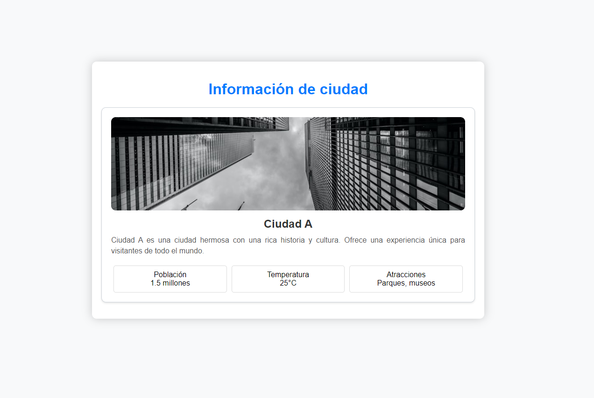

Para esta práctica deberás replicar el siguiente diseño utilizando componentes de React.

Para la imagen puedes utilizar el siguiente link:

https://source.unsplash.com/800x400/?city


**Nota:** Este ejercicio será evaluado y deberás presentarlo al finalizar el tiempo de la práctica calificada de hoy.

**Consideraciones**

- Si el ejercicio está igual que en la imagen, tendrás un 90% de la nota, el otro 10% tiene que ver con tu creatividad al agregarle más detalles.
- Tu proyecto de React debe tener más de dos componentes.
- Para la revisión, debes subir un archivo PDF con las capturas de pantalla de tu código y de tu página renderizada.
  
