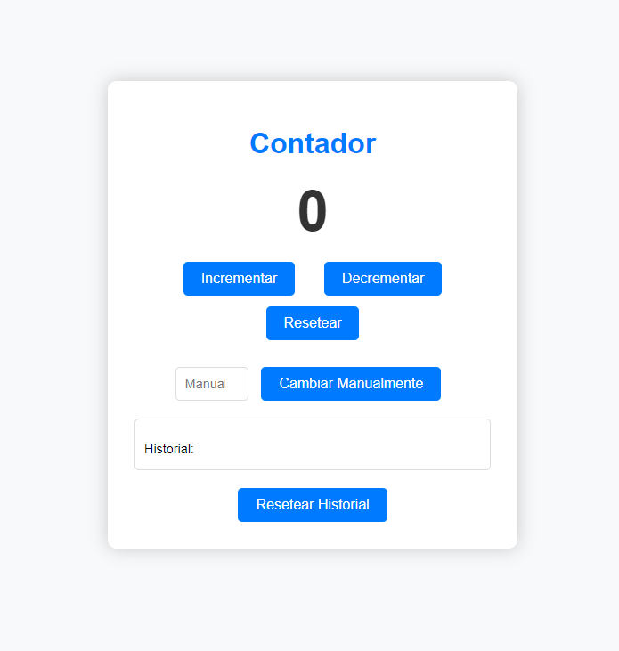
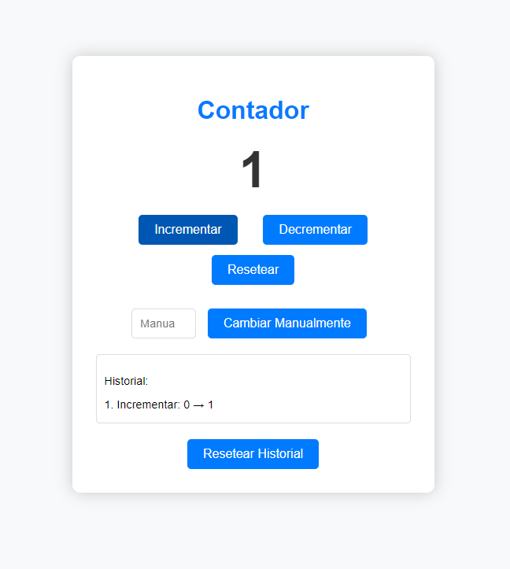
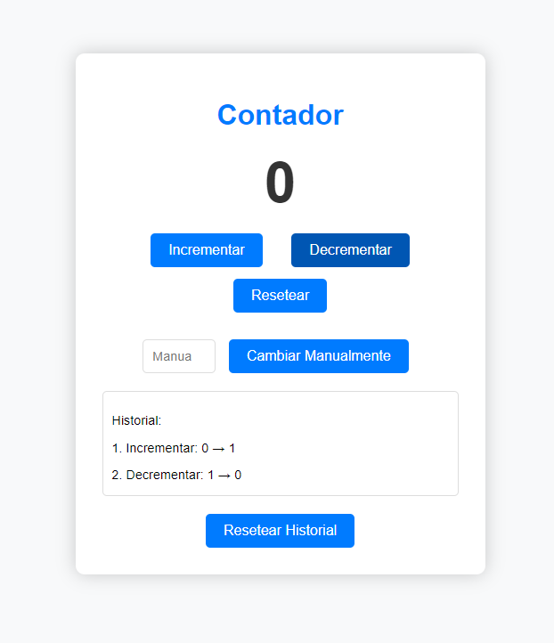
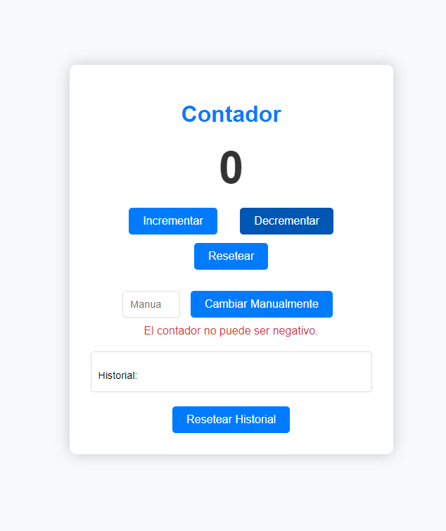
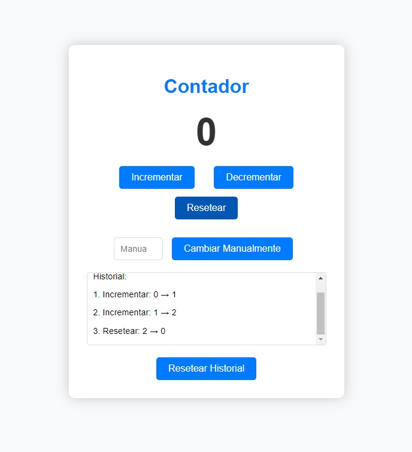
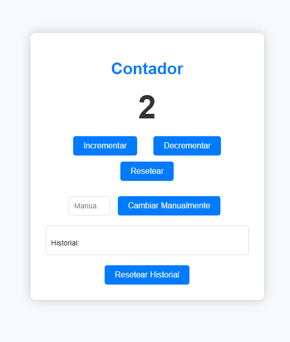
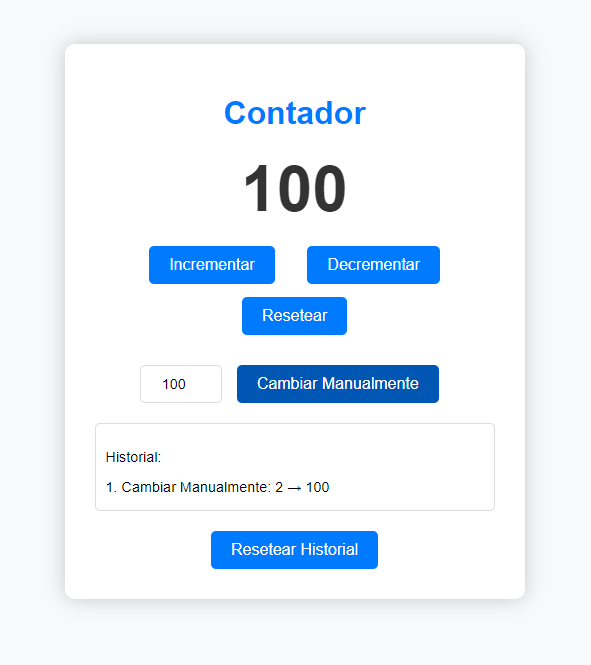
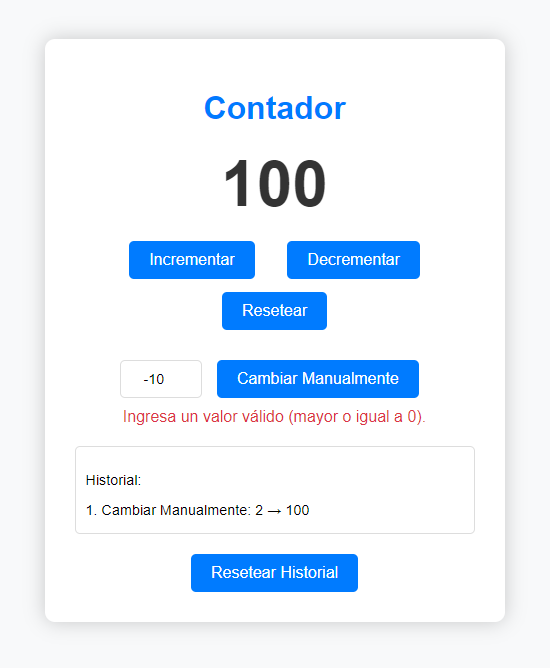

## Diseño

El diseño es el siguiente:

### Sin interacción

### Al dar click en 'Incrementar'

### Al dar click en 'Decrementar'

### Al dar click en 'Decrementar' cuando el contador ya está en 0

### Al dar click en 'Resetear'

Nótese que primero se incrementó el contador hasta el número 2, y luego se reseteó a 0.

### Al dar click en 'Resetear historial'

Nótese que primero se incrementó el contador hasta el número 2, y luego se reseteó solo el historial, no se reseteó el contador.

### Al dar click en 'Cambiar manualmente'

Escribimos 100 en el input y luego damos click al boton "Cambiar manualmente".

### Intentar colocar un número negativo

## Instrucciones

Este ejercicio tiene como objetivo brindarte práctica en el desarrollo de componentes interactivos utilizando React. Crearemos una aplicación de contador que incluya características avanzadas, como la capacidad de deshacer acciones y mantener un historial de las operaciones realizadas.

1. **Creación de Componentes:**

   - Utiliza React para estructurar tu aplicación en componentes. Crea al menos los siguientes componentes:
     - `Contador`: Representa el componente principal que mostrará el valor actual del contador.
     - `Boton`: Componente reutilizable que representará un botón con una función específica. Puede ser utilizado para incrementar, decrementar o resetear el contador.
     - `EntradaManual`: Proporcionará una entrada numérica para cambiar el valor del contador manualmente.
     - `MensajesError`: Mostrará mensajes de error en caso de que se ingresen valores incorrectos.

2. **Estilo Visual:**

   - Implementa animaciones o transiciones para resaltar la interactividad de los elementos.

3. **Contador y Botones:**

   - El componente `Contador` deberá mostrar el valor actual del contador.
   - Utiliza el componente reutilizable `Boton` para crear botones que realicen las siguientes acciones:
     - Incrementar el contador en 1.
     - Decrementar el contador en 1 (con la restricción de no permitir números negativos).
     - Resetear el contador a 0.

4. **Entrada Manual y Validación:**

   - El componente `EntradaManual` deberá proporcionar una entrada numérica que permita al usuario cambiar el valor del contador manualmente.
   - Implementa la validación en `EntradaManual` para **asegurar que el valor sea mayor o igual a 0**.

5. **Manejo de Errores:**

   - Utiliza el componente `MensajesError` para mostrar mensajes de error cuando se ingresan valores incorrectos o se intenta decrementar por debajo de 0.

6. **Historial de Acciones con UseState:**

   - Utiliza el hook `useState` para mantener un estado local que almacene el historial de acciones realizadas en el contador.
   - Muestra el historial de acciones en un componente dedicado.

7. **Resetear Historial:**

   - Agrega un botón que permita al usuario resetear completamente el historial de acciones.

**Desafío Adicional:**

- Implementa una nueva funcionalidad que permita al usuario cambiar el color del contador y de los botones dinámicamente.
  - Crea un nuevo componente llamado `SelectorColor` que contenga una lista desplegable con opciones de colores.
  - Al seleccionar un color, cambia dinámicamente el fondo del contador y el color del texto, así como el fondo de los botones.
  - Asegúrate de que la elección del color persista incluso después de realizar acciones como incrementar, decrementar o resetear el contador.
- Implementa la funcionalidad de deshacer utilizando el hook `useState` para rastrear el estado anterior del contador.
  - Permite al usuario deshacer la última acción realizada.

**Conclusión:**
Este ejercicio te proporcionará experiencia práctica en la creación y gestión de componentes interactivos en una aplicación React. Asegúrate de comprender cómo los diferentes componentes interactúan entre sí y cómo se gestionan los estados para brindar una experiencia de usuario fluida. ¡Éxito en tu práctica!


**Nota:** Este ejercicio será evaluado y deberás presentarlo al finalizar el tiempo de la práctica calificada de mañana.

**Consideraciones**

- Si el ejercicio está igual a lo solicitado, tendrás un 100% de la nota.
- Tu proyecto de React debe tener como mínimo 4 componentes (Contador, Boton, EntradaManual, MensajesError).
- Para la revisión, debes subir un archivo PDF con las capturas de pantalla de tu código y de tu página renderizada.
  
