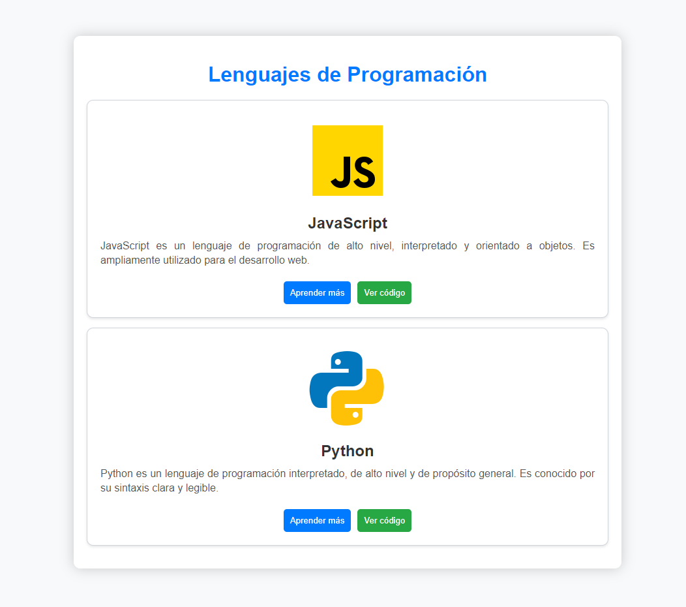

Crea una aplicación React para mostrar información sobre diferentes lenguajes de programación. La aplicación debe utilizar componentes y props para representar cada lenguaje de programación de manera dinámica.

## Diseño

El diseño es el siguiente:

Para las imágenes puedes usar:

- https://img.icons8.com/color/144/000000/javascript.png
- https://img.icons8.com/color/144/000000/python.png

## Instrucciones

1. **Componente Card:**

   - Crea un componente funcional llamado `ProgrammingLanguageCard` que acepta propiedades (`props`) para representar la información de un lenguaje de programación específico.
   - Este componente debe renderizar la imagen del logo del lenguaje, el título, una descripción y dos botones: uno para "Aprender más" y otro para "Ver código".
   - Utiliza el componente `ProgrammingLanguageCard` para representar la información de JavaScript y Python. Asegúrate de que la información se pase a través de props.

2. **Renderización Dinámica:**

   - Modifica el código React para que pueda manejar la renderización dinámica de múltiples lenguajes de programación.
   - Crea un array de objetos, donde cada objeto representa la información de un lenguaje de programación diferente. Puedes agregar más lenguajes si lo deseas.
   - Utiliza un bucle o la función `map` para renderizar las tarjetas de lenguaje de programación de manera dinámica.

3. **Funciones de Botones (Opcional):**

   - Agrega funciones a los botones "Aprender más" y "Ver código" dentro del componente `ProgrammingLanguageCard`.
   - Estas funciones pueden ser simples alertas por ahora, pero si lo deseas, puedes expandirlas para realizar acciones más significativas.

4. **Estilo Adicional (Opcional):**
   - Si lo deseas, experimenta con estilos adicionales para mejorar la apariencia de las tarjetas de lenguajes de programación.
   - Puedes ajustar colores, fuentes, tamaños y márgenes según tus preferencias.

Al completar este ejercicio, tendrás una aplicación React que muestra información sobre diferentes lenguajes de programación de manera dinámica y estilizada.


**Nota:** Este ejercicio será evaluado y deberás presentarlo al finalizar el tiempo de la práctica calificada de hoy.

**Consideraciones**

- Si el ejercicio está igual que en la imagen, tendrás un 90% de la nota, el otro 10% tiene que ver con tu creatividad al agregarle más detalles.
- Tu proyecto de React debe tener como mínimo 4 cards (sí, tienes que agregarle 2 más al diseño de la imagen).
- Para la revisión, debes subir un archivo PDF con las capturas de pantalla de tu código y de tu página renderizada.
  
