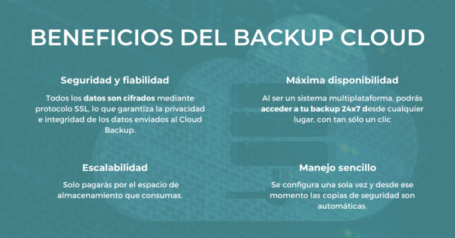
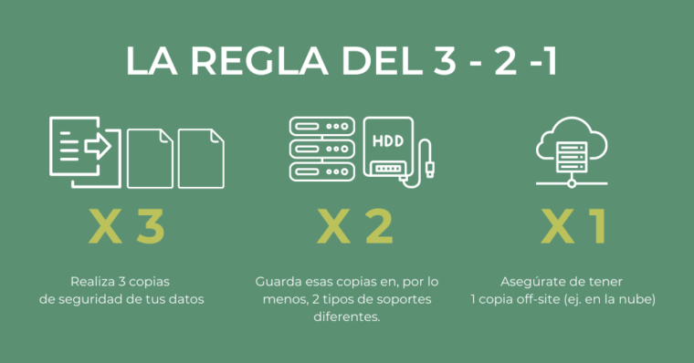

El respaldo de datos es una práctica fundamental en la gestión de bases de datos que implica crear copias de seguridad periódicas para proteger la información crítica almacenada en ellas. Este artículo explora la importancia de realizar copias de seguridad en bases de datos, destacando los riesgos potenciales de no hacerlo y los beneficios que aporta esta práctica para garantizar la integridad y continuidad de los datos. Además, se discuten diferentes tipos de copias de seguridad y las mejores prácticas para implementar un sistema de respaldo efectivo.

## Introducción

En el mundo digital actual, los datos son uno de los activos más valiosos para organizaciones e individuos. Las bases de datos juegan un papel central en la recopilación y almacenamiento de información crítica. Sin embargo, los datos están expuestos a diversas amenazas, como fallas de hardware, errores humanos, ataques cibernéticos y desastres naturales. El respaldo adecuado de una base de datos se convierte en una salvaguardia vital para proteger la integridad de los datos y asegurar la continuidad del negocio.

## Riesgos de no hacer backup

La falta de copias de seguridad regulares puede llevar a graves consecuencias. Cuando una base de datos sufre una pérdida catastrófica, pueden ocurrir pérdidas de datos irreparables y una interrupción significativa en la operatividad del sistema. Esto puede resultar en la pérdida de ingresos, daño a la reputación de la organización y posibles implicaciones legales. Sin un respaldo adecuado, se compromete la confidencialidad, integridad y disponibilidad de la información almacenada.

## Beneficios de realizar copias de seguridad

Hacer copias de seguridad de una base de datos proporciona varios beneficios, entre los cuales se destacan:

- **Recuperación ante desastres**: Las copias de seguridad permiten restaurar rápidamente la base de datos en caso de una pérdida de datos o un desastre, reduciendo el tiempo de inactividad y minimizando las pérdidas.

- **Protección contra errores humanos**: Los errores humanos son comunes y pueden provocar la eliminación accidental de datos importantes. El respaldo garantiza que se puedan revertir estos cambios no deseados.

- **Seguridad frente a ataques cibernéticos**: Los ciberataques, como ransomware y ataques de denegación de servicio, pueden corromper o eliminar datos valiosos. Con copias de seguridad, es posible recuperar los datos sin tener que ceder ante las demandas de los ciberdelincuentes.

- **Pruebas y desarrollo**: Las copias de seguridad también son útiles para realizar pruebas y experimentos en entornos de desarrollo sin afectar los datos en producción.

## Mejores prácticas para el respaldo de bases de datos

Algunas recomendaciones para implementar un sistema de respaldo efectivo incluyen:

- **Programación regular**: Establecer una programación adecuada de copias de seguridad, según la criticidad de los datos y la frecuencia de cambios.

- **Almacenamiento seguro**: Mantener las copias de seguridad en ubicaciones seguras y fuera del sitio para protegerse contra robos y desastres naturales.

- **Pruebas de restauración**: Realizar periódicamente pruebas para asegurarse de que las copias de seguridad sean efectivas y se puedan restaurar correctamente.

- **Mantenimiento de registros**: Mantener un registro detallado de las copias de seguridad realizadas y las fechas correspondientes.

Podemos clasificar las copias de seguridad en función de la manera de copiar los datos o el dispositivo o ubicación de la copia.

## Copias de seguridad según la ubicación

Un backup puede hacerse de diferentes maneras, todo dependerá del tipo de empresa, sector, tamaño… Lo principal es que las copias de seguridad nunca se almacenen en un mismo lugar sino en, al menos, dos soportes distintos o diferente ubicación. Por ejemplo, una copia en la nube y otra en local o dos copias en local pero en ubicaciones distintas (Ej. Alicante y Valencia).

Las copias de seguridad pueden almacenarse:

### En la nube (Backup Cloud)

Consiste en hacer una copia de seguridad de los datos o archivos que elijamos (de nuestros ordenadores, servidores, móvil…) en un almacenamiento seguro en la nube.

El objetivo es que siempre tengamos acceso a la información, desde cualquier lugar y dispositivo, para poder recuperarla en caso de que suframos un ciberataque, fallos de hardware o software, robos…



### En local

La copia de seguridad local es cuando el almacenamiento está en el hadware de la propia empresa (cabinas de discos duros o racks, cintas magnética de almacenamiento de datos…)

Entre sus ventajas encontramos la capacidad de restauración, ya que obtendremos todos nuestros datos sin tener que enviar una solicitud al servidor remoto que gestione nuestras copias de seguridad ni tener que conectarnos a internet.

## Copias de seguridad según la forma de copiar los datos

### Completa (Full Backup)

Este tipo de copia es la más importante ya que almacena todos los datos o archivos guardados de la empresa. Se suele realizar una vez a la semana. Los datos se recuperan de forma sencilla, pero ocupa más espacio y el proceso es más lento.

### Diferencial (Backup diferencial)

Este tipo podríamos decir que se encuentra entre la copia completa y la incremental, ya que el proceso es más rápido que en un backup completo pero requiere más espacio que un backup incremental.

Guarda solo los datos nuevos o modificados desde la última copia completa.

### Incremental (Backup incremental)

Este tipo de backup es el más completo ya que solo realiza la copia de los archivos que han sido modificados desde la última copia. El software comparará las fechas de modificación de archivos, copiando solamente aquellos con fecha más reciente.

Al requerir menos espacio que una copia completa, permite ahorrar almacenamiento y ofrece mayor rapidez.

## Buenas prácticas para hacer una copia de seguridad

Ahora que, esperemos, ya confías en la importancia de los backups vamos a darte una serie de consejos para llevar a cabo este proceso:

### No esperes a que ocurra el problema

Si piensas que a ti nunca te pasará nada… ¡estás equivocado! Como bien dice el dicho, “mejor prevenir que curar”. Contar con un con un sistema de respaldo de tu información como Veeam Backup for Office 365, Azure Backup o NetApp SaaS Backup for Microsoft Office 365, te ayudará a poner a salvo tu negocio.

### Sigue la regla del 3-2-1

- Realiza 3 copias de seguridad de tus datos.
- Guarda esas copias en, al menos, 2 tipos de soportes diferentes
- Asegúrate de tener 1 copia en otro site (como almacenamiento en la nube)



### Asegúrate que las copias de seguridad realmente funcionan

Imagina que necesitas recuperar algún archivo y cuando vas a utilizar la copia de seguridad no responde o no está disponible…

Es muy importante realizar pruebas con los backups para comprobar que realmente ese proceso se está haciendo correctamente.

## Exportar una base de datos MySQL o MariaDB

Para realizar la exportación de la base de datos se utiliza el comando mysqldump desde la consola. Una vez realizado el backup, el archivo generado se puede mover fácilmente. Para empezar a exportar la base de datos hay que ejecutar lo siguiente:

```arduino
mysqldump -u nombre_usuario -p nombre_bbdd > nombre_archivo_dump.sql
```

- `nombre_usuario` hace referencia al nombre del usuario de la base de datos.
- `nombre_bbdd` hay que sustituirlo por el nombre de la base de datos que quieres exportar.
- `nombre_archivo_dump.sql` es el archivo que se generará con toda la información de la base de datos.


Si el comando te genera el error `mysqldump is not recognized as an internal or external command`, puedes ver el siguiente video:


<br>


