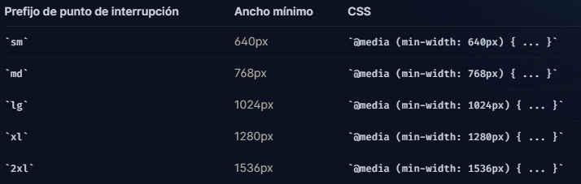

## ¿Qué es Responsive Design?

Responsive Design (Diseño Responsivo) es una técnica de diseño web que busca adaptar y optimizar la apariencia y la experiencia de usuario de un sitio web en diferentes dispositivos y tamaños de pantalla. El objetivo principal es garantizar que el contenido y el diseño se vean bien y sean fáciles de usar en computadoras de escritorio, tablets, smartphones y otros dispositivos.

## Tailwind CSS y Responsive Design

Tailwind CSS es un framework de CSS utility-first que proporciona una forma eficiente de construir interfaces responsive y personalizables. El enfoque utility-first de Tailwind CSS facilita la creación de diseños responsive, ya que ofrece un conjunto completo de clases utilitarias que permiten ajustar el diseño en función de las necesidades de diferentes dispositivos.

## Clases Responsive en Tailwind CSS

Tailwind CSS ofrece clases especiales para trabajar con diseños responsive. Estas clases utilizan el prefijo "sm:", "md:", "lg:", "xl:", y "2xl:" para definir diferentes tamaños de pantalla. Cuando se usan, los estilos asociados se aplicarán solo a las pantallas con el tamaño especificado o superior.



## Ejemplos con Código

- Ocultar un elemento en pantallas pequeñas y mostrarlo en pantallas medianas y superiores:

```html
<div class="hidden sm:block">
  Este contenido estará oculto en pantallas pequeñas pero visible en pantallas
  medianas y superiores.
</div>
```

- Cambiar el tamaño del texto en diferentes tamaños de pantalla:

```html
<h1 class="text-2xl sm:text-3xl md:text-4xl lg:text-5xl xl:text-6xl">
  Título Responsive
</h1>
```

- Alineación de elementos en diferentes tamaños de pantalla:

```html
<div
  class="flex justify-center sm:justify-start md:justify-between lg:justify-end xl:justify-around"
>
  <div>Elemento 1</div>
  <div>Elemento 2</div>
  <div>Elemento 3</div>
</div>
```

## Trabajando móvil primero

De forma predeterminada, Tailwind utiliza un sistema de punto de interrupción de prioridad móvil, similar al que podría estar acostumbrado en otros marcos como Bootstrap.

### Orientación a pantallas móviles

Donde este enfoque sorprende a la gente con mayor frecuencia que, para diseñar algo para dispositivos móviles, debe usar la versión sin prefijo de una utilidad, no la versión con el prefijo `sm`. No pienses que `sm` significa "en pantallas pequeñas", piensa que es "en el punto de interrupción pequeño ".

- No utilizar `sm` para segmentar dispositivos móviles

```html
<!-- Esto solo centrará el texto en pantallas de 640 px y más anchas, no en pantallas pequeñas -->
<div class="sm:text-center"></div>
```

- Use utilidades sin prefijo para apuntar a dispositivos móviles y anúlelas en puntos de interrupción más grandes.

```html
<!-- Esto centrará el texto en el móvil y lo alineará a la izquierda en pantallas de 640 px y más anchas. -->
<div class="text-center sm:text-left"></div>
```

Por esta razón, a menudo es una buena idea implementar primero el diseño móvil para un diseño, luego superponer cualquier cambio que tenga sentido para las pantallas `sm`, seguido de pantallas `md`, etc.

## Personalización de Breakpoints en Tailwind CSS

Además de los breakpoints predefinidos, Tailwind CSS permite personalizar los puntos de quiebre según tus necesidades. En el archivo "tailwind.config.js", puedes modificar la propiedad "breakpoints" para agregar o ajustar los tamaños de pantalla:

```javascript
module.exports = {
  theme: {
    screens: {
      'tablet': '640px',
      // => @media (min-width: 640px) { ... }

      'laptop': '1024px',
      // => @media (min-width: 1024px) { ... }

      'desktop': '1280px',
      // => @media (min-width: 1280px) { ... }
    },
  }
}
```

Luego, puedes usar estos breakpoints personalizados en tu código:

```html
<div class="hidden tablet:block">
  Este contenido estará oculto en pantallas más pequeñas que 'tablet' y visible
  en 'tablet' y superiores.
</div>
```

## Valores arbitrarios

Si necesita usar un punto de interrupción único que no tiene sentido incluir en su tema, use los modificadores `min` o `max` para generar un punto de interrupción personalizado sobre la marcha usando cualquier valor arbitrario.

```html
<div class="min-[320px]:text-center max-[600px]:bg-sky-300">
  <!-- ... -->
</div>
```

## Ventajas del Responsive Design en Tailwind CSS

- **Facilidad** de uso: Tailwind CSS facilita la creación de interfaces responsive al proporcionar clases utilitarias y breakpoints predefinidos.
- **Flexibilidad**: Con la personalización de breakpoints, puedes adaptar el diseño de manera más precisa a las necesidades de tu proyecto.
- **Eficiencia**: Utilizar clases utilitarias reduce la necesidad de escribir CSS personalizado, lo que puede resultar en hojas de estilo más livianas y un mejor rendimiento del sitio.
- **Consistencia**: Tailwind CSS proporciona una metodología coherente para trabajar con estilos responsive, lo que facilita el mantenimiento y la colaboración en proyectos.


